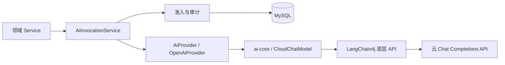

# AI 子系统架构

## 目标与边界

AI 提供解析、复习建议、知识总结、学习资产、变式训练、投稿辅助和学习诊断。权限、正式题发布、
判分与学习事实继续由业务层维护。Tutor Agent 的分阶段目标见[路线图](../product/roadmap.md#tutor-agent-升级)。

## 模块与调用方向

- `backend/ai-core`：项目模型契约、严格 JSON 校验、云协议适配；不依赖 Spring 或课程业务。
- `backend/app`：Spring Boot 应用、鉴权、领域 Service、配额事务、审计与数据库。
- `AiInvocationService` 是领域生成的唯一调用入口，依赖方向由 ArchUnit 校验。
- `AiProvider` 保留文本便捷方法；没有用户身份的旧领域生成方法拒绝调用。

选择和取舍见 [ADR-0007](decisions/0007-tutor-model-foundation.md)。

## 模型契约

`ModelRequest` 包含消息列表、模型参数、工具定义和可选输出 Schema。消息可以携带 assistant
工具请求与匹配的 tool 结果；拒绝孤立结果、重复调用 ID 或缺失结果的历史。

`ModelResult` 明确区分 `STOP`、`TOOL_CALLS`、`LENGTH`、`REFUSAL`，返回响应标识、模型和
本次调用的 usage。网络、协议、Schema、取消、超时等失败通过 `ModelException.Code` 表达，
已经获得的元数据随异常保留。旧文本入口将不完整结果转换为业务异常。

工具参数与结构化结果使用本地 JSON Schema 校验，同时拒绝重复 JSON 字段和尾随内容。
工具参数的根支持对象属性、required、additionalProperties 和 description；属性内部可使用
Schema 约束。外部引用与动态方言不允许加载，业务约束仍须由领域服务校验。

## 流式链路

核心事件为 `TextDelta` 与 `Completed`。工具参数只在完整结果校验后返回；结构化输出不发送
未校验的 JSON 片段。缺少上游完成原因的 EOF 或 `[DONE]` 被视为协议失败。

旧前端 SSE 仍接收内容事件及 done/error。已经发送的普通文本无法撤回，但流中断不能继续缓存为
完整资产或产生成功教学事件。异步执行器捕获并恢复 MDC，使请求 trace 能传入工作线程。

## 调用治理

1. 校验模型能力与请求；未启用或不支持的调用不访问上游。
2. 独立短事务锁定用户，检查配额并插入唯一 `call_id` 对应的 `RUNNING` 日志。
3. 事务提交后调用云 API；不启用 SDK 隐式重试。
4. 更新同一日志的结果、耗时、实际模型、结束原因、用量及成本。

配额统计包含未确认调用；完成日志列表、调用成功率与运营报告排除 `RUNNING`。完成审计失败
保留原登记记录，并按 call ID 报告审计故障。不会将未确认请求伪装成未计费请求。

价格在准入时快照，优先按上游实际模型名称匹配；未提供模型时保留请求模型。未知价格或缺失
必要 usage 时成本为空。输入、输出、总量分别保留上游值，不通过字符数或相减补齐。
失败结果也可能包含真实用量。成本计算支持 Embedding 的输入计费语义，Embedding 调用尚未接入。

日志保留请求模型、可选 run ID、Prompt 指纹和完整模型配置指纹，不保存原始 Prompt、响应正文或
凭据。记录语义见[AI 与治理数据](../reference/database/ai-and-governance.md)。

## 学习资产与变式题

学习资产继续按题目和类型缓存。变式题完整校验后，将公开题干与服务端私有答案分开存储；
用户提交真实答案后，由后端首次判分。正式题仍需管理员批准发布。

旧 Markdown 资产保留显式完成接口，但不冒充结构化首次判分样本。
学习效果统计只表达观察性关联，样本不足返回 `INSUFFICIENT_DATA`。

## 配置与验证

云配置见[配置说明](../getting-started/configuration.md#ai)。工具和结构化输出默认关闭，须先确认
云模型能力再启用。LLM 与后续 Embedding 均使用云 API，隔离测试使用确定性 HTTP 上游。

核心协议测试、领域回归、固定 AI Evaluation 和真实 MySQL 集成验证各自的边界；真实云模型
评测仍需明确配置并独立运行。当前验证结果见[项目状态](../project/status.md)。
