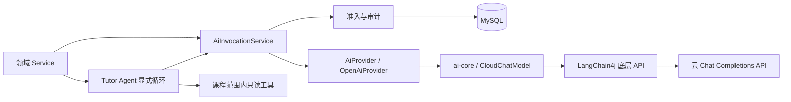

# AI 子系统架构

## 目标与边界

AI 提供解析、复习建议、知识总结、学习资产、变式训练、投稿辅助和学习诊断。权限、正式题发布、
判分与学习事实继续由业务层维护。Tutor Agent 的分阶段目标见[路线图](../product/roadmap.md#tutor-agent-升级)。

## 模块与调用方向

- `backend/ai-core`：项目模型契约、严格 JSON 校验、云协议适配；不依赖 Spring 或课程业务。
- `backend/app`：Spring Boot 应用、鉴权、领域 Service、配额事务、审计与数据库。
- `AiInvocationService` 是领域生成的唯一调用入口，依赖方向由 ArchUnit 校验。
- `AiProvider` 保留文本便捷方法；没有用户身份的旧领域生成方法拒绝调用。

## Tutor Agent 执行循环

Tutor Agent 在应用层显式维护模型消息与工具结果，不使用 SDK 自动循环。一次用户提问可触发多次云调用，
每次调用都通过统一准入与审计并共享同一 `run_id`；工具回填最多三轮，跳过必需工具、未知工具、非法参数
或超出上限均不会保存为可见回答。首批 `read_tutor_lesson` 与 `read_learning_evidence` 工具只读取当前用户、
课程和 Tutor 会话已经绑定的服务端事实，参数不能指定其他资源，教学工具也不会返回理解检查答案。
每次提问的首次工具列表必须以 `read_tutor_lesson` 开始，同批后续可读取学习证据或检索知识；
顺序违规在调用治理的结果校验中拒绝，记录协议失败且不执行该批工具。

教学编排通过 `present_tutor_check` 生成服务端确认的展示动作，并通过 `read_tutor_check_result` 读取
真实首次判分。工具复用 `TutorSessionService` 的权限和公开内容投影，不接受模型代提交答案。
动作随成功回复原子持久化，恢复历史时保留“已提供检查入口”的语义，但不能把展示或聊天自述记为作答。
用户显式操作既有检查接口后才写课程学习事件；后续模型指导由用户再次确认发起。

成功的一轮用户消息与最终回答原子追加到持久对话，运行停在 `WAITING_USER`；下一问题通过条件更新领取为
`RUNNING`，避免同一运行并发推进。每次领取分配独立执行标识与数据库时钟的 10 分钟租约；
到期可重新领取，成功与失败回写均绑定执行标识，旧请求不能污染新轮次。模型调用不占用数据库长事务，
失败或进程中断后可由原会话继续恢复。浏览器刷新
恢复只保存会话标识，所有权和审查状态仍由后端重新校验。详细取舍见
[ADR-0008](decisions/0008-tutor-agent-execution-loop.md)。

选择和取舍见 [ADR-0007](decisions/0007-tutor-model-foundation.md)。

## 模型契约

`ModelRequest` 包含消息列表、模型参数、工具定义和可选输出 Schema。消息可以携带 assistant
工具请求与匹配的 tool 结果；拒绝孤立结果、重复调用 ID 或缺失结果的历史。

`ModelResult` 明确区分 `STOP`、`TOOL_CALLS`、`LENGTH`、`REFUSAL`，返回响应标识、模型和
本次调用的 usage。网络、协议、Schema、取消、超时等失败通过 `ModelException.Code` 表达，
已经获得的元数据随异常保留。旧文本入口将不完整结果转换为业务异常。

工具参数与结构化结果使用本地 JSON Schema 校验，同时拒绝重复 JSON 字段和尾随内容。
工具参数的根支持对象属性、required、additionalProperties 和 description；属性内部可使用
Schema 约束。外部引用与动态方言不允许加载，业务约束仍须由领域服务校验。

## 流式链路

核心事件为 `TextDelta` 与 `Completed`。工具参数只在完整结果校验后返回；结构化输出不发送
未校验的 JSON 片段。缺少上游完成原因的 EOF 或 `[DONE]` 被视为协议失败。

旧前端 SSE 仍接收内容事件及 done/error。已经发送的普通文本无法撤回，但流中断不能继续缓存为
完整资产或产生成功教学事件。异步执行器捕获并恢复 MDC，使请求 trace 能传入工作线程。

## 调用治理

1. 校验模型能力与请求；未启用或不支持的调用不访问上游。
2. 独立短事务锁定用户，检查配额并插入唯一 `call_id` 对应的 `RUNNING` 日志。
3. 事务提交后调用云 API；不启用 SDK 隐式重试。
4. 更新同一日志的结果、耗时、实际模型、结束原因、用量及成本。

配额统计包含未确认调用；完成日志列表、调用成功率与运营报告排除 `RUNNING`。完成审计失败
保留原登记记录，并按 call ID 报告审计故障。不会将未确认请求伪装成未计费请求。

价格在准入时快照，优先按上游实际模型名称匹配；未提供模型时保留请求模型。未知价格或缺失
必要 usage 时成本为空。输入、输出、总量分别保留上游值，不通过字符数或相减补齐。
失败结果也可能包含真实用量。成本计算支持 Embedding 的输入计费语义，Embedding 已通过独立 Provider 接入同一调用入口与审计。

日志保留请求模型、可选 run ID、Prompt 指纹和完整模型配置指纹，不保存原始 Prompt、响应正文或
凭据。记录语义见[AI 与治理数据](../reference/database/ai-and-governance.md)。

## 学习资产与变式题

学习资产继续按题目和类型缓存。变式题完整校验后，将公开题干与服务端私有答案分开存储；
用户提交真实答案后，由后端首次判分。正式题仍需管理员批准发布。

旧 Markdown 资产保留显式完成接口，但不冒充结构化首次判分样本。
学习效果统计只表达观察性关联，样本不足返回 `INSUFFICIENT_DATA`。

## 知识内容快照

首版 408 [知识快照](../../content/knowledge/cs408/README.md)已从 AiStu 复制到本仓库，
保留稳定知识点 ID、检索片段、考纲映射、内部来源记录、上游提交和文件哈希。
快照内容仍为 `review_pending`，不能标为已审核课程内容。管理员可显式导入服务端配置的版本目录，
后端校验清单、哈希、课程归属与引用后，原子保存版本和片段。同版本不能覆盖，导入独立平台状态为
`PENDING`；来源审核字段不构成发布授权。数据库语义见[AI 与治理数据](../reference/database/ai-and-governance.md#版本化知识内容)。

云 Embedding 已具备独立配置、取消/超时、严格向量索引/维度校验及逐批次配额审计，使用 JDK HTTP
调用 OpenAI 兼容 `/embeddings`，禁止自动重试与重定向。返回顺序按输入索引恢复，未知用量不推算，
协议校验失败仍保留已获得的计费元数据。协议依据 [OpenAI Embeddings API](https://developers.openai.com/api/reference/resources/embeddings/methods/create)。

管理员逐条审查后可将版本从 `PENDING` 标记为 `REVIEWED` 并显式构建 Qdrant 索引。
每批 Embedding 单独计配额与用量，共享本次索引任务的 run ID；网络调用不占数据库长事务。
索引键绑定模型、维度、云端点、向量端点和集合，任务租约允许超时后重新领取，旧运行不能提交成功。
索引只有在全部片段写入成功且版本仍已审核时才进入 `READY`。

`search_course_knowledge` 默认不注册；显式启用后，只能接收 query。会话、课程和用户范围由服务端绑定，
检索前检查用户课程归属和平台审核状态，Qdrant 按版本与索引键过滤并回检 payload。向量库只返回片段标识，
正文与版本引用从 MySQL 读取，返回前再次检查访问范围和撤回状态。实际检索的资料列表由服务端追加到回答，
随原有成功轮次持久化；它表示本轮查阅的资料，不宣称每条资料都支持模型回答中的每个结论。

撤回先在 MySQL 关闭版本可见性，再删除对应向量点。尚有运行中写入租约或旧端点不可用时保留待清理状态，
允许恢复对应端点后重试；只有外部删除确认后才标记 `PURGED`。向量删除失败不恢复学习端可见性。
Qdrant 协议依据 [官方 Points API](https://qdrant.tech/documentation/manage-data/points/)。

## 配置与验证

云配置见[配置说明](../getting-started/configuration.md#ai)。工具和结构化输出默认关闭，须先确认
云模型能力再启用。LLM 与 Embedding 均使用云 API，隔离测试使用确定性 HTTP 上游。

核心协议测试、领域回归、固定 AI Evaluation 和真实 MySQL 集成验证各自的边界。固定评测已纳入
Tutor Agent 的课程工具、学习证据工具、注入边界、稳定 run ID 与逐调用成本/延迟报告；真实云模型
评测仍需明确配置并独立运行。当前验证结果见[项目状态](../project/status.md)。
