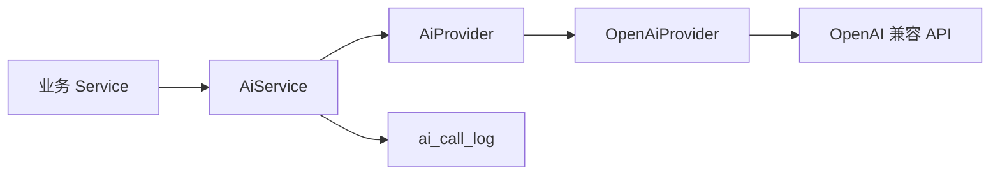
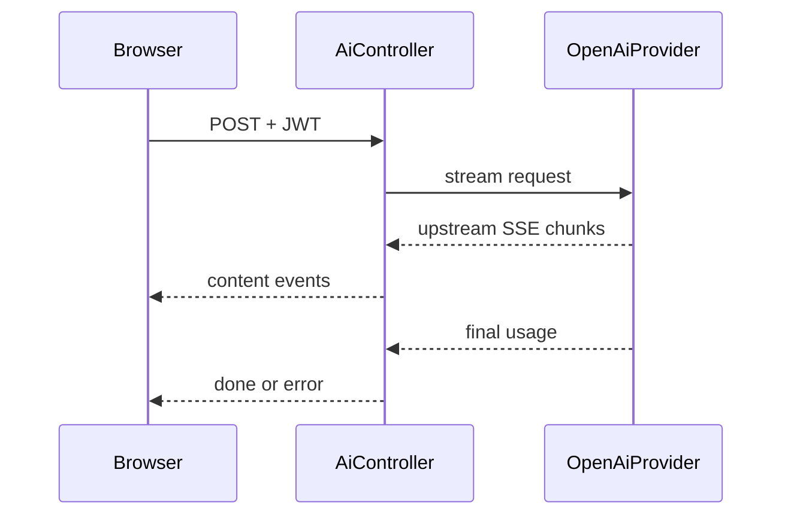

# AI 子系统架构

## 目标与边界

AI 子系统提供解析、复习建议、知识总结、学习资产、变式训练、投稿辅助和学习诊断。AI 不负责最终权限判断、正式题目自动发布、考试判分或学习效果因果结论。

## Provider 抽象

业务 Service 依赖项目 Provider 契约，不读取特定上游响应结构。`OpenAiProvider` 负责同步和流式协议、usage 提取、超时和上游错误归一化。

## 配置

主要环境变量包括：

- `AI_ENABLED`
- `AI_API_BASE_URL`
- `AI_API_KEY`
- `AI_MODEL`
- `AI_TIMEOUT`
- `AI_MAX_TOKENS`

真实 Key 只能来自环境变量或本机秘密管理，不进入 Git、文档示例或日志。

## 流式链路

Nginx 对 AI SSE 路径关闭代理缓冲并增加读取超时。同步接口继续保留给不需要增量渲染的调用方。

## 调用治理

每次统一封装的调用可以固化：

- 功能、用户、模型和成功状态；
- prompt、completion 和 total Token；
- 按当时模型价格计算的成本；
- traceId、Prompt 指纹和模型配置指纹；
- 延迟与错误摘要。

缺少上游 usage 或模型价格时保留未知，不按字符数伪造 Token 或成本。

## 学习资产与变式题

学习资产按题目和资产类型缓存。结构化变式题将公开题干、选项与服务端私有答案分离：

1. AI 输出结构化候选；
2. 后端完整校验题型、选项、答案和难度；
3. 前端只收到公开内容；
4. 用户答案提交到后端；
5. 首次真实判分锁定并完成训练。

旧 Markdown 资产继续兼容显式完成接口，但不冒充结构化首次判分样本。

## 学习效果

效果分析组合真实资产查看、训练、结构化判分和后续练习记录，并同时设置作答量和去重学习者门槛。输出是观察性关联：

- 不表达 AI 导致成绩提升；
- 样本不足返回 `INSUFFICIENT_DATA`；
- 资产类型样本可重叠，不用于自动排名；
- 没有实验设计前不进入自动推荐闭环。

详细数据模型见[AI 与治理数据](../reference/database/ai-and-governance.md)，接口见[AI 学习 API](../reference/api/ai-learning.md)。
