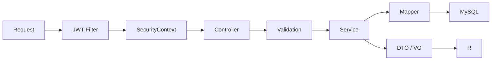

# 后端架构

## 技术与分层

后端使用 Java 21、Spring Boot、Spring Security、MyBatis-Plus、Validation、Flyway、Redis 和 Knife4j。

```text
backend/src/main/java/com/learnplatform/
├── common/       # 统一响应和异常
├── config/       # Security、缓存、AI、文档等配置
├── controller/   # HTTP、校验、角色与 DTO 边界
├── dto/          # 请求、响应和领域投影
├── entity/       # MyBatis-Plus 持久化实体
├── mapper/       # 数据访问
├── security/     # JWT 解析和认证上下文
└── service/      # 业务规则、事务和外部 Provider 编排
```

项目是模块化单体。业务模块通过 Java 类和数据库事务协作，不通过内部 HTTP 调用。

## 请求处理



Controller 不承担复杂查询组合、判分、状态机或事务。Service 不依赖前端展示状态。

## 认证和授权

`SecurityConfig` 当前规则：

- `/api/public/**`、注册、登录、注册邮箱验证和密码重置公开。
- Knife4j/OpenAPI 与允许公开的 Actuator 健康、Prometheus 端点公开。
- `/api/admin/**` 需要 `ADMIN`。
- 其他请求需要 JWT 认证。
- SSE 的异步和错误二次分发允许继续完成，但首次请求仍必须经过认证。

密码使用 BCrypt。登录、注册邮件发送和忘记密码由 Cloudflare Turnstile 服务端校验保护；Turnstile Secret 只从后端环境变量读取。注册邮箱票据和密码重置令牌只保存 HMAC，并在事务中一次性消费。JWT 携带认证版本，修改或重置密码后旧版本 Token 失效。JWT 只建立身份上下文，不替代资源归属和业务权限校验。

## 错误处理

- 参数错误由 Bean Validation 和全局异常处理转换为统一响应。
- 可预期业务拒绝使用明确业务异常。
- 认证失败返回 401，授权失败返回 403。
- 未知异常记录服务端上下文，但响应不得泄露堆栈、SQL 或秘密配置。

## 事务和并发

以下流程必须在明确事务内执行：

- 练习判分、记录和错题同步；
- 考试锁定、逐题判分和提交；
- 投稿审核入库；
- 配额调整与审计；
- 结构化变式题首次判分与训练完成。
- 注册邮箱票据消费与用户创建；
- 密码重置令牌消费、密码更新与认证版本递增。

应用校验之外，数据库唯一约束保护考试答案、用户关系和首次事实等并发不变量。

## 模块边界

- `LearningDiagnosisService` 负责综合诊断与建议编排。
- `LearningQuestionErrorAnalysisService` 负责单题错因分析。
- `SimilarQuestionRecommendationService` 负责相似题候选与评分。
- `QuestionLearningAssetService` 负责编排 AI 学习资产缓存和输出。
- `AiVariantQuestionService` 负责结构化变式题私有答案与判分。
- `AiLearningEffectService` 只输出观察性学习效果。

拆分以独立业务责任为依据，不为了行数机械增加接口和实现类。

## 质量门禁

Maven `verify` 执行测试、Checkstyle、SpotBugs 和 JaCoCo。真实 MySQL 约束由 Testcontainers 分组测试覆盖，具体命令见[测试策略](../development/testing.md)。
