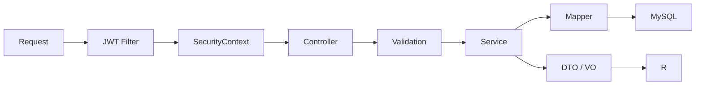

# 后端架构

## 技术与分层

后端使用 Java 21、Spring Boot、Spring Security、MyBatis-Plus、Validation、Flyway、Redis 和 Knife4j。

```text
backend/src/main/java/com/learnplatform/
├── common/       # 统一响应和异常
├── config/       # Security、缓存、AI、文档等配置
├── controller/   # HTTP、校验、角色与 DTO 边界
├── dto/          # 请求、响应和领域投影；稳定业务域可使用子包
├── entity/       # MyBatis-Plus 持久化实体
├── mapper/       # 数据访问
├── security/     # JWT、认证上下文和登录安全策略
└── service/      # 业务规则、事务和外部 Provider 编排
```

项目是模块化单体。业务模块通过 Java 类和数据库事务协作，不通过内部 HTTP 调用。

## 请求处理



Controller 不承担复杂查询组合、判分、状态机或事务。Service 不依赖前端展示状态。
Controller 也不得直接依赖 Mapper 或持久化 Entity；对外响应统一使用 DTO / VO，事务边界
位于 Service。上述依赖方向由 `LayeredArchitectureTest` 在 Maven 测试阶段自动校验。
同一稳定 URL 前缀可以由多个 Controller 按查询维护、治理和文件交换等职责分别承载，
不为了维持单个类而聚合无关 Service；拆分类时必须保持既有路径、参数与响应契约兼容。

## 认证和授权

`SecurityConfig` 当前规则：

- `/api/public/**`、注册、登录、注册邮箱验证和密码重置公开。
- Knife4j/OpenAPI 与允许公开的 Actuator 健康、Prometheus 端点公开。
- `/api/admin/**` 需要 `ADMIN`。
- 其他请求需要 JWT 认证。
- SSE 的异步和错误二次分发允许继续完成，但首次请求仍必须经过认证。

密码使用 BCrypt。登录、注册邮件发送和忘记密码由 Cloudflare Turnstile 服务端校验保护；Turnstile Secret 只从后端环境变量读取。注册邮箱票据和密码重置令牌只保存 HMAC，并在事务中一次性消费。JWT 携带认证版本，修改或重置密码后旧版本 Token 失效。JWT 只建立身份上下文，不替代资源归属和业务权限校验。

## 错误处理

- 参数错误由 Bean Validation 和全局异常处理转换为统一响应。
- 可预期业务拒绝使用明确业务异常。
- 认证失败返回 401，授权失败返回 403。
- 未知异常记录服务端上下文，但响应不得泄露堆栈、SQL 或秘密配置。

## 事务和并发

以下流程必须在明确事务内执行：

- 练习判分、记录和错题同步；
- 考试锁定、逐题判分和提交；
- 投稿审核入库；
- 配额调整与审计；
- 结构化变式题首次判分与训练完成。
- 注册邮箱票据消费与用户创建；
- 密码重置令牌消费、密码更新与认证版本递增。

应用校验之外，数据库唯一约束保护考试答案、用户关系和首次事实等并发不变量。

## 模块边界

- `LearningDiagnosisService` 是学习诊断兼容门面，只编排数据快照、知识点与课程指标、
  错因汇总、学习习惯、题目推荐和 AI 建议；各计算与外部调用由对应协作者承担。
- `LearningDiagnosisDataLoader` 集中加载练习、错题、知识点及题目—知识点关联事实。
- `LearningDiagnosisKnowledgeAnalyzer`、`LearningDiagnosisErrorPatternAnalyzer` 和
  `LearningDiagnosisHabitAnalyzer` 分别负责知识掌握、错因模式与学习习惯计算。
- `LearningDiagnosisAiAdviceService` 负责诊断提示词调用和流式输出；配额与调用审计委托
  `AiCallGovernanceService`。
- `LearningQuestionErrorAnalysisService` 负责单题错因分析。
- `SimilarQuestionRecommendationService` 负责相似题候选与评分。
- `PracticeService` 是练习接口兼容门面；题目查询与脱敏、历史统计查询和事务判分写入
  分别由 `PracticeQuestionQueryService`、`PracticeHistoryService` 与
  `PracticeAnswerService` 承担。
- `StatisticsService` 负责用户概览、每日趋势、课程统计和管理端平台概览；月度练习、错题、
  考试、复习与学习效果聚合由独立的 `LearningReportService` 承担，并继续使用
  `learningReport` 缓存边界。
- `SpacedRepetitionService` 负责复习计划写事务和 SM-2 调度；待复习筛选、统计聚合、
  卡片 VO 组装与 AI 复习上下文由只读的 `ReviewScheduleQueryService` 承担。
- `service/` 顶层只放 Spring 业务组件；无状态策略与聚合器进入明确领域子包。阶段测评
  快照聚合位于 `service/assessment/`，题目访问策略与重复题文本检测算法位于
  `service/question/`；跨 Service 与 Controller 传递的私有试卷原文件值对象位于
  `dto/exam/`。
- `QuestionService` 负责题目查询、维护与完整展示模型组装；无状态的
  `QuestionDuplicateDetector` 只负责文本归一化、相似度计算和重复题分组，不访问持久化层、
  不处理权限，也不作为 Spring 业务组件注册。
- `QuestionLearningAssetService` 负责编排 AI 学习资产的同步 / 流式生成、缓存与输出；
  `QuestionAssetContextService` 只读取题目、选项、知识点和课程并组装模型上下文；
  `service/ai/QuestionAssetPromptFactory` 只维护七类无状态 Prompt 模板，不读取业务数据、不调用
  AI Provider，也不注册为 Spring 组件。
- `AiAssetEngagementService` 负责用户侧资产查看、当前缓存版本的变式训练状态，以及向
  `AiVariantQuestionService` 委托结构化变式题判分。
- `AiCallGovernanceService` 统一负责用户每日配额、当日用量、调用审计、Token / 成本、
  Trace ID 以及提示词和模型配置指纹；AI 业务服务只保留提示词与内容生成职责，并直接依赖
  该治理边界，不通过宽泛的 `AiService` 间接复用。
- `AiVariantQuestionService` 负责结构化变式题私有答案与判分。
- `AiLearningEffectService` 只读聚合观察性学习效果，不承担用户交互写事务。

拆分以独立业务责任为依据，不为了行数机械增加接口和实现类。

## 质量门禁

Maven `verify` 执行测试、Checkstyle、SpotBugs 和 JaCoCo。真实 MySQL 约束由 Testcontainers 分组测试覆盖，具体命令见[测试策略](../development/testing.md)。
ArchUnit 同时校验 Controller、Service、Mapper、Entity 和 Config 的关键依赖方向，防止
HTTP 层越过 Service 直接访问持久化层；同时要求顶层 `service` 类均为 Spring 组件，
避免值对象、策略和聚合器重新混入业务组件目录。
