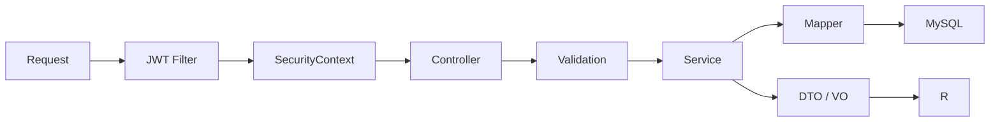

# 后端架构

## 技术与分层

后端使用 Java 21、Spring Boot、Spring Security、MyBatis-Plus、Validation、Flyway、Redis 和 Knife4j。

```text
backend/src/main/java/com/learnplatform/
├── common/       # 统一响应和异常
├── config/       # Security、缓存、AI、文档等配置
├── controller/   # HTTP、校验、角色与 DTO 边界
├── dto/          # 请求、响应和领域投影；稳定业务域可使用子包
├── entity/       # MyBatis-Plus 持久化实体
├── mapper/       # 数据访问
├── security/     # JWT、认证上下文和登录安全策略
└── service/      # 业务规则、事务和外部 Provider 编排
```

项目是模块化单体。业务模块通过 Java 类和数据库事务协作，不通过内部 HTTP 调用。

## 工程归属

- 顶层 `service` 包只放 Spring 业务组件，值对象、无状态策略和聚合器进入 DTO 或明确业务子包。
- Java 类型使用显式导入。生产源码禁止包级及静态星号导入；测试可为 JUnit、Mockito、MockMvc DSL
  保留静态星号导入，分别由生产与测试 Checkstyle 配置执行。
- 业务字段与前端类型保持语义一致；数据库字段使用 `snake_case`，Java 类型沿用既有命名。

## 请求处理



Controller 不承担复杂查询组合、判分、状态机或事务。Service 不依赖前端展示状态。
Controller 也不得直接依赖 Mapper 或持久化 Entity；对外响应统一使用 DTO / VO，事务边界
位于 Service。上述依赖方向由 `LayeredArchitectureTest` 在 Maven 测试阶段自动校验。
同一稳定 URL 前缀可以由多个 Controller 按查询维护、治理和文件交换等职责分别承载，
不为了维持单个类而聚合无关 Service；拆分类时必须保持既有路径、参数与响应契约兼容。

## 认证和授权

`SecurityConfig` 当前规则：

- `/api/public/**`、注册、登录、注册邮箱验证和密码重置公开。
- Knife4j/OpenAPI 与允许公开的 Actuator 健康、Prometheus 端点公开。
- `/api/admin/**` 需要 `ADMIN`。
- 其他请求需要 JWT 认证。
- SSE 的异步和错误二次分发允许继续完成，但首次请求仍必须经过认证。

密码使用 BCrypt。登录、注册邮件发送和忘记密码由 Cloudflare Turnstile 服务端校验保护；Turnstile Secret 只从后端环境变量读取。注册邮箱票据和密码重置令牌只保存 HMAC，并在事务中一次性消费。JWT 携带认证版本，修改或重置密码后旧版本 Token 失效。JWT 只建立身份上下文，不替代资源归属和业务权限校验。

## 错误处理

- 参数错误由 Bean Validation 和全局异常处理转换为统一响应。
- 可预期业务拒绝使用明确业务异常。
- 认证失败返回 401，授权失败返回 403。
- 未知异常记录服务端上下文，但响应不得泄露堆栈、SQL 或秘密配置。

## 事务和并发

以下流程必须在明确事务内执行：

- 练习判分、记录和错题同步；
- 考试锁定、逐题判分和提交；
- 投稿审核入库；
- 配额调整与审计；
- 结构化变式题首次判分与训练完成。
- 注册邮箱票据消费与用户创建；
- 密码重置令牌消费、密码更新与认证版本递增。

应用校验之外，数据库唯一约束保护考试答案、用户关系和首次事实等并发不变量。

## 模块边界

| 业务域 | 主要入口 | 责任边界 |
|---|---|---|
| 课程与教学 | `CourseLibraryService`、`CourseStageAssessmentService` | 课程关系、教学状态与测评使用同一课程事实；概览读取事实，不制造掌握度 |
| 练习与复习 | `PracticeService`、`SpacedRepetitionService` | 查询与展示组装同判分写事务分离，学习事实回写遵循[数据流](data-flow.md) |
| 考试与试卷学习 | `ExamService`、`ExamPaperLearningService` | 独立会话状态机与提交语义，共享题源与学习事件；事务见[考试数据](../reference/database/assessment-domain.md) |
| 私有导入与草稿 | `PrivateExamImportService`、`PrivateExamDraftService` | 解析、人工复核和确认持久化分离，所有者隔离贯穿来源文件与草稿 |
| 内容与投稿 | `QuestionService`、`QuestionSubmissionService` | 查询富化与修改事务分离；审核和正式入库是独立业务动作 |
| AI 与观察 | [AI 子系统](ai-system.md) | 生成调用统一治理；查看和真实判分负责写事实，效果统计只读聚合 |

无状态解析、选题策略、聚合与展示转换放入明确领域子包；需要读取事实的协作者保留在业务层，
访问校验和事务由业务服务执行。跨层值对象使用 DTO，不为拆分引入无意义的包装接口。
组件内部协作关系以源码为准，架构只维护模块入口与不应越过的边界。

## 质量门禁

Maven `verify` 执行测试、Checkstyle、SpotBugs 和 JaCoCo。真实 MySQL 约束由 Testcontainers 分组测试覆盖，具体命令见[测试策略](../development/testing.md)。
ArchUnit 同时校验 Controller、Service、Mapper、Entity 和 Config 的关键依赖方向，防止
HTTP 层越过 Service 直接访问持久化层；同时要求顶层 `service` 类均为 Spring 组件，
避免值对象、策略和聚合器重新混入业务组件目录。
