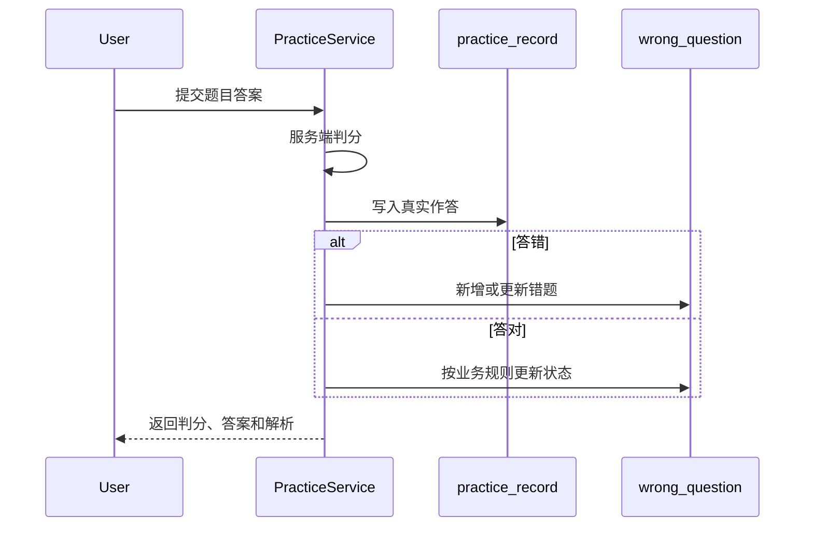
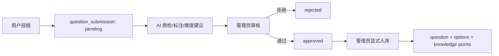
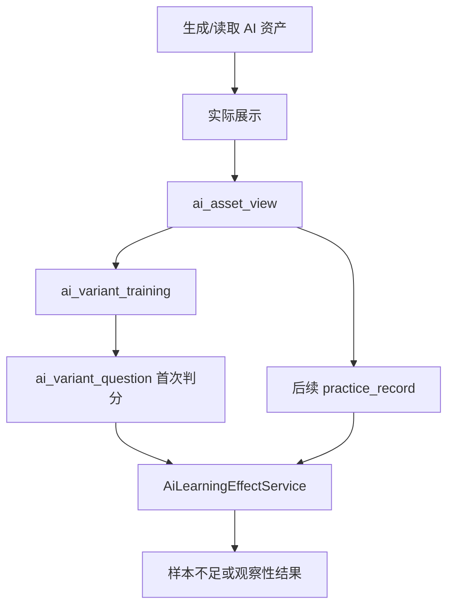

# 核心数据流

## 练习与错题

## 考试

开始考试创建 `exam_record`。提交时锁定记录，校验归属、状态、题目集合和时限，再写入 `exam_answer` 并固化总分。详细事务见[练习与考试数据](../reference/database/assessment-domain.md)。

## 投稿与正式入库

AI 只提供辅助结果，不能越过管理员自动发布。

## 间隔重复

练习答错或手动加入会创建、更新 `question_review_schedule`。用户提交复习质量后，SM-2 计算下一次间隔和到期时间。复习计划是当前调度状态，历史真实表现仍来自作答记录。

## AI 资产与效果观察

生成、缓存命中和预加载都不等于真实查看；只有用户实际展开后才记录查看事件。

## AI 用量治理

Provider 返回 usage 后，后端检查用户配额、固化 Token/成本/trace/指纹并聚合管理端报表。配额调整与审计同事务；提醒可选通知 webhook，但确认状态保存在数据库。
