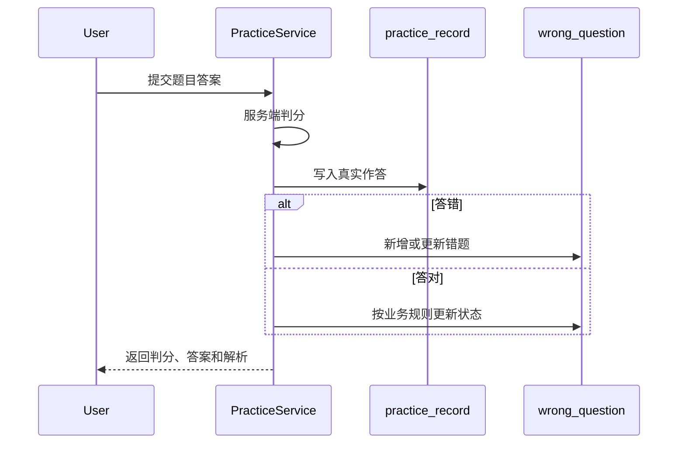
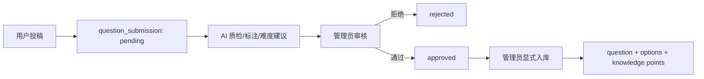
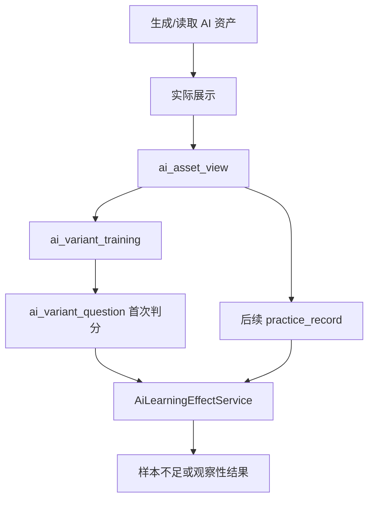

# 核心数据流

## 课程目录与个人课程库

公共 `course` 与 `knowledge_point` 保存课程内容结构，`user_course` 保存当前用户加入的
课程。加入操作由 `(user_id, course_id)` 唯一约束保护并保持幂等；该关系只建立学习
入口，不产生学习事件，也不改变掌握状态。跨端导入内容通过可空的稳定 `content_key`
引用，来源字段不替代独立的内容审核状态。

## 课程学习事件

已加入课程库的用户完成练习、复习、考试逐题作答或结构化 AI 变式题首次判分后，服务端在
同一事务内把来源记录映射为 `course_learning_event`。事件使用来源记录 ID 形成稳定幂等键，
保留事件版本、入口与业务发生时间；它是课程总览聚合的事实来源，而不是另一个掌握度字段。

课程总览仅在用户已加入对应课程时读取事件，并将当前用户的到期复习计划、未掌握错题按题目
归属限定到该课程。它还从已审查 Tutor 内容和该用户课程内的 Tutor 会话导出可访问内容的
`NOT_STARTED`、`IN_PROGRESS`、`COMPLETED` 状态：首次正确检查优先为完成，任何其他已建立会话为
进行中，没有会话才是未开始。该状态不为尚未迁入的目录节点生成伪进度。候选学习目标优先级为
未完成 Tutor 内容、到期复习、未掌握错题、课程目录默认起点；这些均是可解释的下一步建议，不会
写回进度或宣称掌握度。

开始 Tutor 会话时，服务端从目标知识点及其同课程祖先目录关联的题目中读取试卷学习、试卷 AI、错题
和复习事实，将计数与最近发生时间保存为 `tutor_session` 的聚合快照并返回客户端。已审查教学内容本身
仍保持确定性，快照不包含原始答案、正确答案或 AI 输出，也不根据计数推断掌握度。

## 课程阶段测评

已加入课程的用户创建阶段测评时，服务端锁定个人课程关系并恢复已有进行中会话，或从当前可见的已发布
客观题中按未掌握错题、到期复习、近期错误课程事件和题目 ID 选题。没有学习信号时明确记录确定性课程
题序策略，不推断画像或伪装成 AI 个性化。题干、选项、正确答案和解析在会话中固化；提交前只返回题干
与选项。完整提交后服务端按快照判分，在同一事务内保存作答、释放活动会话键，并更新错题、复习计划和
`STAGE_ASSESSMENT` 来源课程事件；重复提交已完成会话只读取既有结果。
已完成会话继续作为不可变历史按所有者和课程分页读取；课程总览只取最近一条题数、正确数和完成时间，
逐题复盘读取原会话快照。展示这些事实不计算掌握度，也不从两次测评自动推导趋势。

## 练习与错题

## 考试

开始考试创建 `exam_record`。提交时锁定记录，校验归属、状态、题目集合和时限，再写入 `exam_answer` 并固化总分。详细事务见[练习与考试数据](../reference/database/assessment-domain.md)。

## 试卷学习

已加入课程的用户可以为该课程下的已发布试卷创建或恢复一个进行中 `exam_learning_session`。每次逐题
提交都会在锁定会话后校验用户、试卷与题目边界，由服务端判分并追加 `exam_learning_answer`；判分结果
继续投影到错题、复习计划和课程学习事件。全部题目至少尝试一次后，会话才能完成并转为只读逐题复盘。
这条链路不复用 `exam_record`，因此不会削弱考试模式的时限、完整提交和提前隐藏答案规则。

题目首次作答后，学习者可以请求解析或变式辅导。服务端重新校验会话所有者、课程、试卷和题目边界，
并把最近一次 `exam_learning_answer` 的答案、尝试序号和判分结果加入 AI 上下文；调用状态写入
`exam_learning_ai_interaction`，成功后再投影为课程学习事件。未作答时前后端都拒绝调用，避免通过通用
题目助手绕过试卷学习的答案边界。

## 投稿与正式入库

AI 只提供辅助结果，不能越过管理员自动发布。

## 间隔重复

练习答错或手动加入会创建、更新 `question_review_schedule`。用户提交复习质量后，SM-2 计算下一次间隔和到期时间。复习计划是当前调度状态，历史真实表现仍来自作答记录。

## AI 资产与效果观察

生成、缓存命中和预加载都不等于真实查看；只有用户实际展开后才记录查看事件。

## AI 用量治理

Provider 返回 usage 后，后端检查用户配额、固化 Token/成本/trace/指纹并聚合管理端报表。配额调整与审计同事务；提醒可选通知 webhook，但确认状态保存在数据库。
