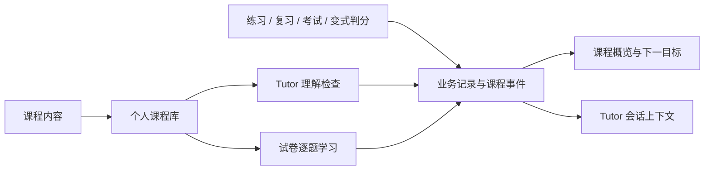
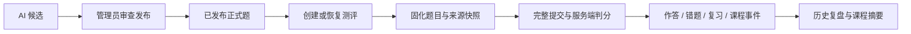
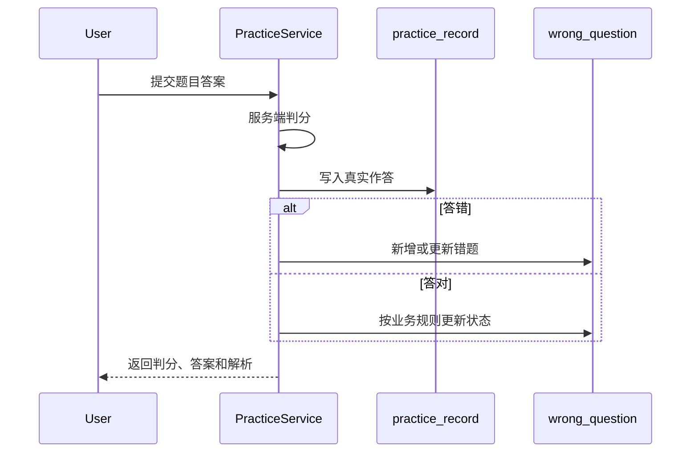
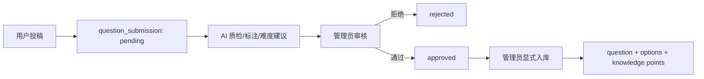
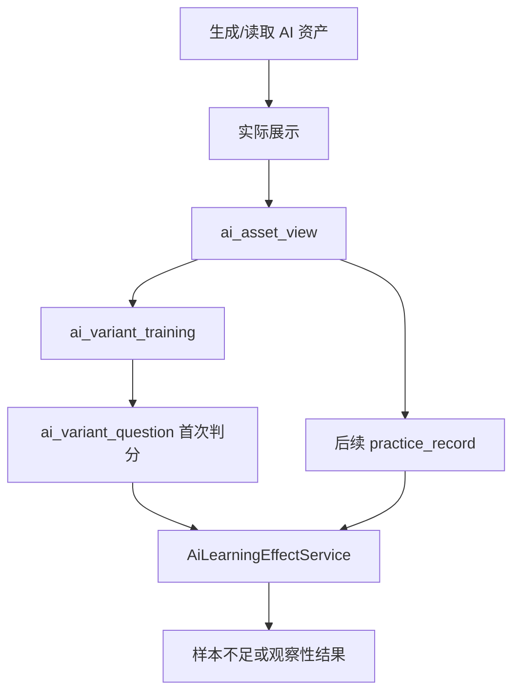

# 核心数据流

## 课程目录与个人课程库

课程内容经个人课程库连接到用户的学习入口。加入课程建立关系，真实作答与理解检查产生学习事实；
课程概览与 Tutor 从这些事实读取上下文，不维护另一套客户端进度。

## 课程学习事件

事实由各业务写事务投影到课程事件，概览读取事件、错题、复习与 Tutor 会话，教学上下文则在会话启动时
保存聚合快照。查询和推荐不会反向写成掌握事实。事件幂等、原始记录与快照的关系见
[课程事实与 Tutor 快照](../reference/database/learning-domain.md#课程事实与-tutor-快照)；
进度状态、目标排序及响应字段见[课程概览 API](../reference/api/learning-content.md#课程概览)。

## 课程阶段测评

组卷消费已发布题目，不在测评中生成或批准候选题。创建、选题与重复提交行为见
[阶段测评 API](../reference/api/learning-content.md#阶段测评)，锁定、快照及原子回写见
[测评存储与事务](../reference/database/learning-domain.md#阶段测评存储与事务)。

## 练习与错题

## 考试

开始考试创建 `exam_record`。提交时锁定记录，校验归属、状态、题目集合和时限，再写入 `exam_answer` 并固化总分。详细事务见[练习与考试数据](../reference/database/assessment-domain.md)。

## 试卷学习

试卷学习使用独立会话，逐题作答连接判分、复习与课程事件；完成后提供逐题复盘。
它与限时考试共享内容和事实投影，保留各自的提交与成绩语义。

AI 辅导消费学习会话中的最近一次作答，成功交互回到课程事件，并供后续 Tutor 上下文读取。
入口权限、答案开放时机与辅导类型见[试卷学习 API](../reference/api/exams.md#用户端试卷学习)，
会话锁定、尝试记录与交互状态见[试卷学习事务](../reference/database/assessment-domain.md#试卷学习事务)。

## 投稿与正式入库

AI 只提供辅助结果，不能越过管理员自动发布。

## 间隔重复

练习答错或手动加入会创建、更新 `question_review_schedule`。用户提交复习质量后，SM-2 计算下一次间隔和到期时间。复习计划是当前调度状态，历史真实表现仍来自作答记录。

## AI 资产与效果观察

生成、缓存命中和预加载都不等于真实查看；只有用户实际展开后才记录查看事件。

## AI 用量治理

调用前检查配额，结束后记录 usage 与审计供管理端报表聚合。调用边界见[AI 子系统](ai-system.md#调用治理)，
配额调整、审计和提醒确认的持久化语义见[治理数据](../reference/database/ai-and-governance.md)。
