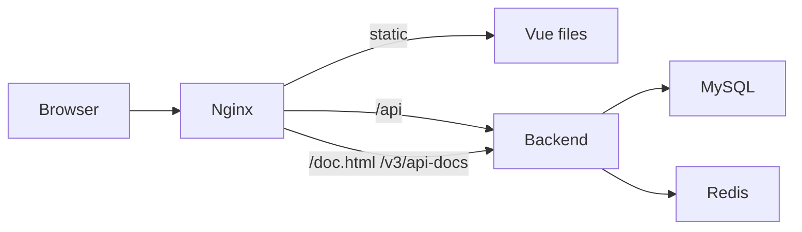

# 部署架构

## Compose 服务

| 服务 | 职责 | 默认宿主端口 |
|---|---|---:|
| `frontend` | Nginx 静态站点与 API 反向代理 | `80` |
| `backend` | Spring Boot API | `8080` |
| `mysql` | 主数据库，仅 Compose 网络访问 | 不公开 |
| `redis` | 缓存，本机回环地址绑定 | `6379` |
| `loki` | 日志存储 | `3100` |
| `prometheus` | 指标采集 | `9090` |
| `grafana` | 指标和日志看板 | `3000` |

端口可通过 `.env` 中对应 `*_HOST_PORT` 覆盖。敏感变量只写入本地 `.env`，仓库只保存 `.env.example`。

## 请求路径

Nginx 为 SPA 使用 `try_files ... /index.html`。AI SSE 路径禁用代理缓冲，避免生成结束后才一次性返回。

## 健康检查

- 后端：`/api/public/health`
- 前端：Nginx 根路径
- Prometheus：`/-/healthy`
- Grafana：`/api/health`
- Loki：`/ready`

Compose 通过健康条件控制后端、前端和监控依赖启动顺序。

## 数据与迁移

- MySQL 数据保存在命名卷 `mysql-data`。
- Redis、Prometheus、Grafana 和 Loki 使用独立命名卷。
- 后端启动时由 Flyway 执行 V1–V19。
- Compose 的 MySQL 初始化挂载 V1 只用于首次空卷引导；后续结构演进仍由后端 Flyway 完成。

## 环境边界

- 本地开发、Docker 和 E2E 使用不同 Spring Profile 或 Compose 覆盖。
- E2E 环境使用隔离端口和数据，避免污染日常开发库。
- 生产部署至少需要更换数据库密码、JWT Secret、Grafana 密码和可选 AI Key。
- 不把开发演示账号和默认密码用于公开生产环境。

启动步骤见[Docker 开发](../getting-started/docker-development.md)，验证策略见[测试策略](../development/testing.md)。
