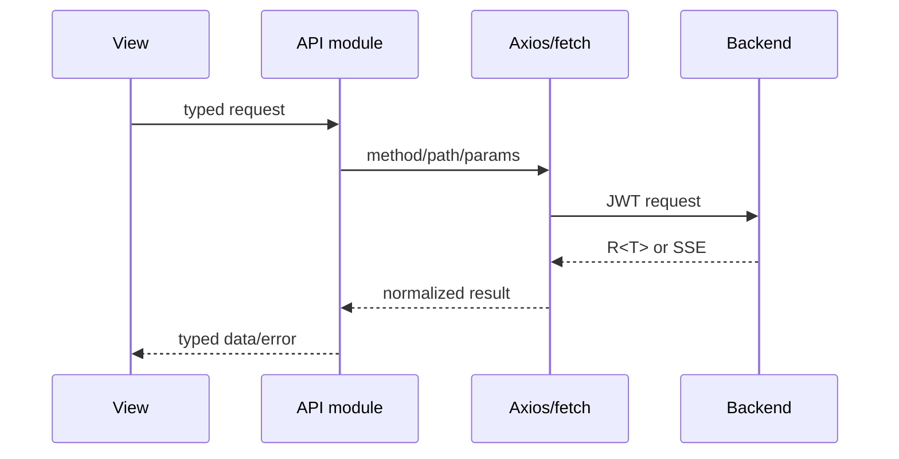

# 前端架构

## 技术与职责

前端使用 Vue 3、TypeScript、Vite、Element Plus、Pinia、Vue Router、Axios 和 ECharts。学习端仍承载尚未
迁移的 `/admin` 页面；独立管理端首个切片已经建立自己的入口、Router、布局和构建产物，并在过渡路径
`/admin-app/` 已承载平台总览、课程、知识点、题目、试卷与主观题批阅。两个构建继续复用稳定的 API
类型、请求客户端、鉴权存储和设计变量。

```text
frontend/src/
├── admin/        # 独立管理端入口、Router、布局与管理端专属页面
├── api/          # 按业务域封装请求和 TypeScript 契约
├── assets/       # 全局样式与静态资源
├── components/   # 可复用组件与布局
├── router/       # 路由、登录和角色守卫
├── stores/       # 用户等跨页面状态
├── types/        # 共享类型
├── utils/        # 请求、格式化和领域辅助函数
└── views/        # 用户端与管理端页面
frontend/admin/   # 独立管理端 HTML 入口
```

目录清单只描述稳定边界，不枚举每个页面文件；真实文件以源码为准。

`npm run build` 先生成学习端 `dist/`，再由 `vite.admin.config.ts` 生成 `dist/admin-app/`；管理端可以用
`npm run dev:admin` 在 5174 端口独立开发。迁移期间旧 `/admin/**` 路由继续存在，待全部管理页面迁完并
完成权限与部署回归后，再将独立构建从 `/admin-app/` 切换到目标 `/admin/`。

## 页面分层

- `views/` 负责页面级数据编排、路由参数和业务状态。
- `components/` 负责可复用交互和展示，不直接复制页面级请求逻辑。
- `api/` 统一方法、路径和参数，页面不得散落 Axios URL。
- `stores/` 只保存跨页面状态；局部表单和弹窗状态留在页面或组合函数中。
- 大页面优先拆出领域组件、组合函数和纯展示映射，不建立无意义的包装层。

## 请求链路



普通接口经过统一 Axios 层处理 Token、业务错误和未登录跳转。AI 流式接口使用带 JWT 的 `fetch` 与 `ReadableStream`，单独处理取消、错误和完成事件。

## 路由与权限

- 路由守卫根据登录状态和用户角色控制导航。
- 管理页面隐藏只是体验优化，真正权限由后端 `/api/admin/**` 校验。
- 页面不得通过修改 Pinia 或 localStorage 获得管理权限。
- 登录失效由统一请求层清理本地状态并引导重新认证。
- 请求层不直接依赖任一 Router；两个入口分别注册登录跳转处理器。独立管理端会在路由进入和登录成功时
  双重检查 `ADMIN` 角色，但安全边界仍是后端 `/api/admin/**` 权限校验。

## 内容安全

- AI 和 Markdown 内容先解析，再使用 DOMPurify 净化。
- 不直接使用未经净化的 `v-html`。
- 题目详情、考试作答页在提交前不展示正确答案。
- 外部链接、代码块、Mermaid 和可视化组件必须限制可执行内容。

## 质量边界

- API 模块使用契约测试验证方法、路径和参数。
- 组合函数和纯工具使用 Vitest。
- 关键页面状态使用组件或页面测试。
- 登录、练习、考试、投稿审核等真实闭环使用隔离 Docker Playwright E2E。
- Element Plus 和 ECharts 按需加载；大依赖继续按页面边界拆包。

前端视觉和交互规则见项目 `frontend-design` Skill，测试分层见[测试策略](../development/testing.md)。
