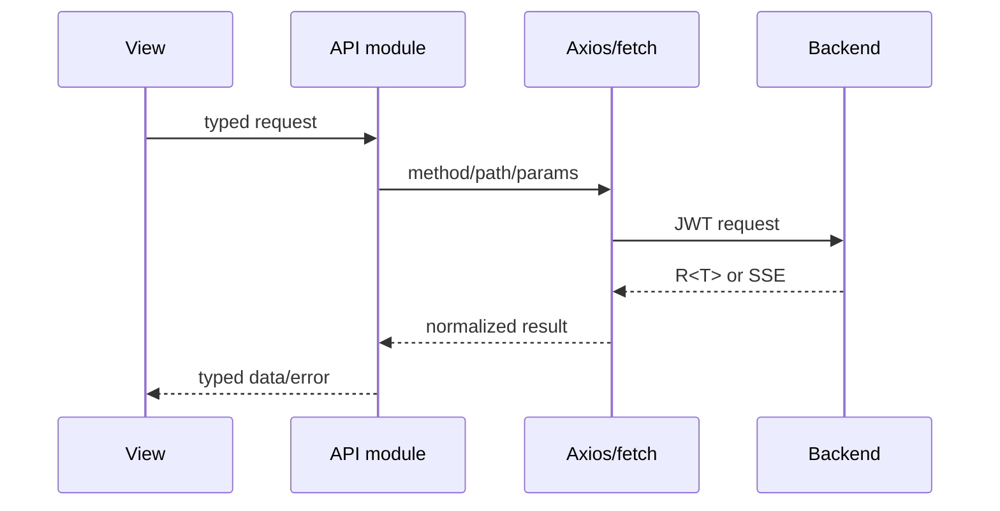

# 前端架构

## 技术与职责

前端使用 Vue 3、TypeScript、Vite、Element Plus、Pinia、Vue Router、Axios 和 ECharts。学习端与管理端
拥有独立 HTML 入口、Router、布局和构建产物；`/admin/` 承载全部管理页面，学习端不再注册管理路由。
两个构建继续复用稳定的 API 类型、请求客户端、鉴权存储和设计变量。

```text
frontend/src/
├── admin/        # 独立管理端入口、Router、布局与全部管理端页面
├── api/          # 按业务域封装请求和 TypeScript 契约
├── assets/       # 全局样式与 Design Tokens
├── components/   # 可复用组件（ui/ 基础组件、layout/ 布局、course/ 领域组件）
├── router/       # 路由、登录和角色守卫
├── stores/       # 用户等跨页面状态
├── types/        # 共享类型
├── utils/        # 请求、格式化、学习目标导航等辅助函数
└── views/        # 学习端路由页面
frontend/admin/   # 独立管理端 HTML 入口
```

目录清单只描述稳定边界，不枚举每个页面文件；真实文件以源码为准。

`npm run build` 先生成学习端 `dist/`，再由 `vite.admin.config.ts` 生成 `dist/admin/`；管理端可以用
`npm run dev:admin` 在 5174 端口独立开发。管理端 HTML 使用 `/src/admin/main.ts` 入口，管理端 Vite
配置把 `/src` 映射到项目真实源码目录，使 `admin/` root 下的开发服务器与生产构建使用同一入口。
学习端管理员通过外部链接进入 `/admin/`，普通学习路由与管理路由不再共享 Router 或布局。

## 信息架构

学习端以「我的课程 + 课程库」为一级入口，登录默认进入「我的课程」：

- 一级导航：我的课程（`/my-courses`）、课程库（`/courses`）。
- 练习、错题、复习、测评、真题等能力优先进入具体课程内部（课程空间 `CourseOverview`），
  但保留全局路由（`/practice`、`/wrong-questions`、`/review`、`/exams`、`/questions` 等）。
- 旧统计/诊断类页面（学习诊断）从一级导航隐藏但路由保留；学习报告、学习路径、知识图谱、
  AI 复习建议等与课程学习流程重复的旧页面已删除。
- 真正学习页面（Tutor、限时考试、试卷学习、考试结果）使用沉浸式 `FocusLayout`，弱化全局导航，
  让学习内容成为界面中心；考试模式仍完整展示时间、进度与作答状态。

## 视觉与设计系统

- `assets/styles/tokens.css` 是唯一视觉来源：颜色、字体、间距、圆角、边框、阴影、动效、布局、
  z-index 均以 CSS 变量定义（Quiet Digital Textbook 方向）。
- `components/ui/` 提供全局注册的基础组件（`LpPageHeader`、`LpSectionHeading`、`LpStat`、
  `LpEmptyState`、`LpSkeleton`、`LpDivider`、`LpSignal`、`LpProgress`、`LpKicker`），
  页面与组件不得随手定义裸色值/裸尺寸。
- 视觉与交互规范见项目 `frontend-design` Skill。

## 页面分层

- `views/` 负责学习端页面级数据编排、路由参数和业务状态；管理端页面统一位于
  `admin/views/`，不得回流到学习端页面目录。
- `components/` 负责可复用交互和展示，不直接复制页面级请求逻辑。
- `components/course/CourseOverviewContent` 自包含课程空间的加载、错误、空数据、目录、学习工具和学习事实
  展示；`CourseOverviewView` 只负责路由、真实 API、学习入口与阶段测评状态机。
- `components/QuestionVisualInteractive` 只处理加载、解析失败回退与空状态；可视化类型分派、图表和
  Mermaid 渲染、树结构递归展示分别位于 `components/question-visual/`，内容解析保持为纯函数。
- `components/layout/useResponsiveSidebar` 管理学习端布局的视口监听与移动侧栏状态；
  `views/exam/useExamCountdown` 管理服务端权威时间偏移、倒计时和卸载清理，页面只处理超时业务结果。
- `components/statistics/` 承载学习诊断的概览、错因、推荐和详情弹窗；诊断 View 继续
  负责 API、SSE、路由与练习会话编排，展示组件只接收类型化数据并发出用户意图。
- `components/exam/` 承载学习端考试页的独立业务闭包：`ExamRecordList` 自包含记录查询、
  分页、状态 / 分数映射、响应式展示和记录导航，`PrivateExamSourceManager` 自包含私有来源
  查看、原文件分页、下载和关联删除，`PrivateExamDraftReview` 自包含 AI 答案建议、人工逐题
  复核和草稿原文件下载；`ExamListView` 与 `PrivateExamImportDialog` 分别保留列表和导入流程
  编排，通过类型化属性、事件与少量公开命令连接这些闭包。
- `admin/views/ai-usage/` 承载 AI 运营报告、学习效果观察、样本结构和调用明细展示；
  `AiUsageView` 只编排周期、接口加载、提醒确认与图表生命周期。
- `admin/views/exam/` 承载试卷管理中的独立业务对话框；智能组卷组件自行管理规则表单、
  预览和创建生命周期，`ExamManage` 只负责打开入口和创建后的列表刷新；题型与试卷来源标签映射
  位于纯展示模块 `examManagePresentation`。
- `views/practice/reviewSuggestionStream` 负责 AI 复习建议 SSE 数据帧消费，`reviewPresentation`
  负责路由数字归一化与状态标签映射，`ReviewView` 保留复习会话和页面级 API 编排。
- `views/practice/usePracticeAnswer` 管理练习答案、可提交状态与多选归一化，练习展示和退出路由映射保持为
  纯函数；`components/search/` 管理全局搜索快捷键、结果扁平索引与文本高亮，搜索对话框保留 API 和焦点编排。
- `admin/views/submission/` 承载投稿管理的 AI 质检、知识点标注和难度评估工具；工具组件
  自行管理请求和结果状态，只有知识点应用成功时向 `SubmissionManage` 发出列表刷新事件。
- `admin/views/question/` 承载正式题库的自包含编辑能力；题目编辑器拥有表单校验、选项
  规则、课程知识点加载和创建 / 更新请求，导入导出组件拥有文件选择、结果展示和既有
  composable 生命周期；`QuestionManage` 只转发命令并在保存或导入后刷新列表。
- `api/` 统一方法、路径和参数，页面不得散落 Axios URL。
- `stores/` 只保存跨页面状态；局部表单和弹窗状态留在页面或组合函数中。
- 大页面优先拆出领域组件、组合函数和纯展示映射，不建立无意义的包装层。

## 请求链路



普通接口经过统一 Axios 层处理 Token、业务错误和未登录跳转。AI 流式接口使用带 JWT 的 `fetch` 与 `ReadableStream`，单独处理取消、错误和完成事件。

## 路由与权限

- 路由守卫根据登录状态和用户角色控制导航。
- 管理页面隐藏只是体验优化，真正权限由后端 `/api/admin/**` 校验。
- 页面不得通过修改 Pinia 或 localStorage 获得管理权限。
- 登录失效由统一请求层清理本地状态并引导重新认证。
- 请求层不直接依赖任一 Router；两个入口分别注册登录跳转处理器。独立管理端会在路由进入和登录成功时
  双重检查 `ADMIN` 角色，但安全边界仍是后端 `/api/admin/**` 权限校验。

## 内容安全

- AI 和 Markdown 内容先解析，再使用 DOMPurify 净化。
- 不直接使用未经净化的 `v-html`。
- 题目详情、考试作答页在提交前不展示正确答案。
- 外部链接、代码块、Mermaid 和可视化组件必须限制可执行内容。

## 质量边界

- API 模块使用契约测试验证方法、路径和参数。
- 组合函数和纯工具使用 Vitest。
- 关键页面状态使用组件或页面测试。
- 登录、练习、考试、投稿审核等真实闭环使用隔离 Docker Playwright E2E。
- Element Plus 和 ECharts 按需加载；大依赖继续按页面边界拆包。

前端视觉和交互规则见项目 `frontend-design` Skill，测试分层见[测试策略](../development/testing.md)。
