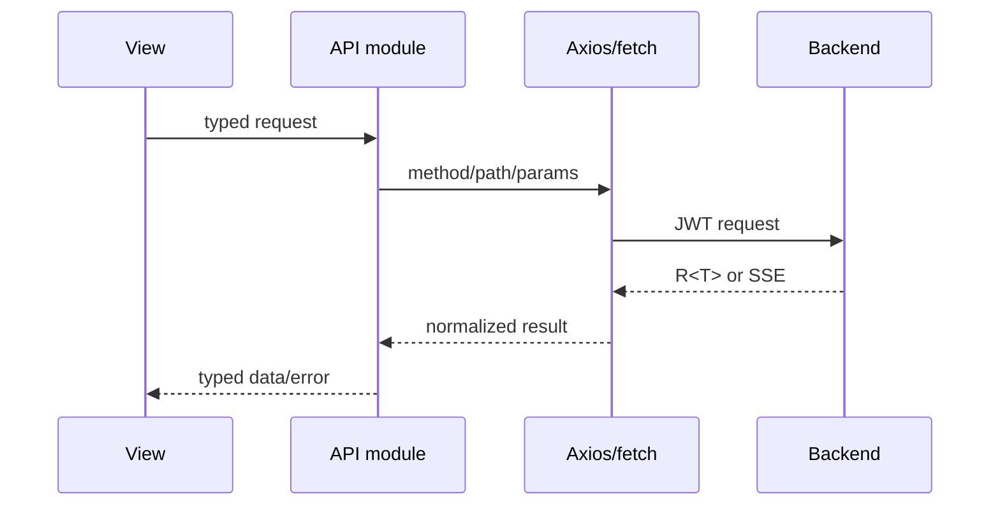

# 前端架构

## 技术与职责

前端使用 Vue 3、TypeScript、Vite、Element Plus、Pinia、Vue Router、Axios 和 ECharts。学习端与管理端
拥有独立 HTML 入口、Router、布局和构建产物；`/admin/` 承载全部管理页面，学习端不再注册管理路由。
两个构建继续复用稳定的 API 类型、请求客户端、鉴权存储和设计变量。

```text
frontend/src/
├── admin/        # 独立管理端入口、Router、布局与全部管理端页面
├── api/          # 按业务域封装请求和 TypeScript 契约
├── assets/       # 全局样式与 Design Tokens
├── components/   # 可复用组件（ui/ 基础组件、layout/ 布局、course/ 领域组件）
├── router/       # 学习端路由记录、Router 与登录守卫
├── stores/       # 用户等跨页面状态
├── types/        # 共享类型
├── utils/        # 请求、格式化、学习目标导航等辅助函数
└── views/        # 学习端路由页面
frontend/admin/   # 独立管理端 HTML 入口
```

目录清单只描述稳定边界，不枚举每个页面文件；真实文件以源码为准。

`npm run build` 先生成学习端 `dist/`，再由 `vite.admin.config.ts` 生成 `dist/admin/`；管理端可以用
`npm run dev:admin` 在 5174 端口独立开发。管理端 HTML 使用 `/src/admin/main.ts` 入口，管理端 Vite
配置把 `/src` 映射到项目真实源码目录，使 `admin/` root 下的开发服务器与生产构建使用同一入口。
学习端管理员通过外部链接进入 `/admin/`，普通学习路由与管理路由不再共享 Router 或布局。

学习端 `router/routes.ts` 与管理端 `admin/routes.ts` 分别维护各自的业务路由记录，Router 模块负责实例与守卫。
开发工具 `/dev/pages` 读取这两份路由记录生成页面目录，选择页面后加载预览，不创建管理端 Router 或批量挂载业务页面。
认证页面的步骤与结果状态统一在该工具中切换，独立认证预览页已移除。
该工具通过学习端的开发环境条件路由加载；使用方式与真实操作边界见[本地开发](../getting-started/local-development.md#全局页面预览)。

## 信息架构

学习端公开首页（`/`）负责产品定位与真实教学示例，不依赖受保护业务接口。登录后的学习工作台
仍以「我的课程 + 课程库」为一级入口，认证成功默认进入「我的课程」：

- 公开入口：首页（`/`）、产品、学习方式、资源、路线图、关于我们占位页，以及登录、注册与账户恢复页面；
  已登录用户也可停留在这些公开页面，再由主要操作返回课程。占位页只建立后续内容入口，不表示对应功能已经实现。
- 一级导航：我的课程（`/my-courses`）、课程库（`/courses`）、社区共建（`/community`）。
- 社区详情使用共享的纯文本讨论组件；管理端 `/admin/community` 承载内容审核、学校分区创建和题目整理，权限由后端校验。
- 练习、错题、复习、测评、真题等能力优先进入具体课程内部（课程空间 `CourseOverview`），
  但保留全局路由（`/practice`、`/wrong-questions`、`/review`、`/exams`、`/questions` 等）。
- 旧统计/诊断类页面（学习诊断）从一级导航隐藏但路由保留；学习报告、学习路径、知识图谱、
  AI 复习建议等与课程学习流程重复的旧页面已删除。
- 真正学习页面（Tutor、限时考试、试卷学习、考试结果）使用沉浸式 `FocusLayout`，弱化全局导航，
  让学习内容成为界面中心；考试模式仍完整展示时间、进度与作答状态。

外壳标明当前页面与课程、社区的父级入口，主导航的 `aria-current` 覆盖子页面。
路径导航完成后聚焦主内容并保留滚动位置，同页筛选不转移焦点。普通页面仅做共享内容入场，旧页面立即移除，
避免进出页面同时占据文档高度；沉浸式页面直接切换。历史返回在内容尚未加载到原高度时短暂等待布局，
最多八秒；主动滚动、键盘操作或新导航会取消这次恢复。Focus 返回优先使用站内历史，无历史时回到课程或考试列表。
有效考试离开前说明未提交答案与持续计时，提交在途阻止离开；提交成功、超时和加载失败的内部跳转正常放行。
页面标题仅在成功导航后更新。

全局搜索具有可命名的对话框、键盘结果选择和关闭后焦点恢复；加载、空结果、错误和建议分别呈现。
搜索、历史操作与运营提醒按请求代际和认证会话隔离，关闭、重开或账号切换后的旧响应不得改写当前界面。
拥有原位错误与重试的调用可设置 `errorDisplay: 'inline'`，避免重复消息；业务码 1002 和 HTTP 401 仍始终执行认证失效处理。

## 视觉与设计系统

- `assets/styles/tokens.css` 是唯一视觉来源：颜色、字体、间距、圆角、边框、阴影、动效、布局、
  z-index 均以 CSS 变量定义；`element-plus.css` 将这些语义变量映射到 Element Plus。应用工作区采用暖纸底色、
  低饱和蓝主操作与焦点的 Quiet Digital Textbook；公开首页使用高对比的编辑式视觉子集，
  两者继续共享语义变量、交互状态与无障碍约束。学习投入记录使用共享低饱和色与文字层级，
  题干、解析、代码和 Markdown 阅读区域保持克制；经验与等级表示学习投入。
- `components/ui/` 提供全局注册的基础组件（包括 `LpPageHeader`、`LpCard`、`LpListItem`、`LpStatePanel`、
  `LpStat`、`LpProgress`、`LpProgressRing`、`LpEmptyState`、`LpSkeleton`、`LpDivider`、`LpSignal`、`LpKicker`）。
  `LpStatePanel` 将 loading、empty、error 与 ready 分开，避免将失败呈现为零数据；页面与组件不得随手定义裸色值/裸尺寸。
- `assets/styles/motion.css` 提供 Vue `Transition` / `TransitionGroup` 的共享内容、披露与列表移动类；
  它只使用 token 化的 opacity 与短距离 transform。`prefers-reduced-motion` 使 CSS 过渡即时，
  并由共享动效类移除位移，
  `useAnimatedNumber` 对服务端数值的后续更新使用可取消 RAF，首次值直接显示。当前不引入新的通用动画库，
  原生 View Transitions 是后续候选，未接入路由。
- 反馈组件集中在 `components/gamification/`，使用后端奖励与概况，不在前端认定积分或成就。
  ADR-0010 定义其安静呈现方向：数据在顶栏、个人页和总结中原位显示，不增加奖励飘字、全屏庆祝、彩纸、连击火焰、成就弹窗或常驻 pulse。
  答题只显示一行已记录事实，无连击徽章；动画不阻塞继续学习。
- 游戏化数据决策见 [ADR-0009](decisions/0009-learning-effort-gamification.md)，视觉与交互规范见项目 `frontend-design` Skill。
- 学习端认证页面采用静态暖纸背景与居中账户卡片；Google 登录入口按后端提供方状态启用，
  未配置的提供方不显示可操作入口。

管理端沿用同一 token 与状态原语，导航按内容维护、审核批阅和平台运营分组；
工作列表保留扫描密度。列表、汇总统计与写操作分别管理请求版本，读取失败显示原位重试，
确认框打开即锁定动作，认证变化或卸载使迟到结果失效。审核失败保留输入和原决定。
图表使用共享语义色和减弱动效，并提供可展开的数据表；观察性学习效果保留原口径、按需展开。

## 页面分层

- 管理页面独占的组件、组合函数和展示映射进入 `admin/views/` 下对应的小写业务目录，不与根目录页面混排。
- `views/` 负责学习端页面级数据编排、路由参数和业务状态；管理端页面统一位于
  `admin/views/`，不得回流到学习端页面目录。
- `components/` 负责可复用交互和展示，不直接复制页面级请求逻辑。
- 页面拥有路由参数、真实 API 和跨组件状态机；独立业务组件可以封装自己的表单、弹窗、分页与请求生命周期，
  通过类型化属性和完成事件协调页面刷新，避免同一状态由两处维护。
- 可视化类型分派、SSE 数据帧解析和展示转换与页面编排分离；解析与映射优先使用纯函数。
- 视口监听、倒计时和可见性观察由组合函数管理生命周期并在卸载时释放；考试倒计时以服务端时间为准，
  资产查看按真实可见性去重，组件挂载本身不表示学习事件。
- `api/` 统一方法、路径和参数，页面不得散落 Axios URL。
- `stores/` 只保存跨页面状态；局部表单和弹窗状态留在页面或组合函数中。
- 大页面优先拆出领域组件、组合函数和纯展示映射，不建立无意义的包装层。

## 请求链路


```mermaid
sequenceDiagram
    participant V as View
    participant A as API module
    participant X as Axios/fetch
    participant B as Backend
    V->>A: typed request
    A->>X: method/path/params
    X->>B: JWT request
    B-->>X: R<T> or SSE
    X-->>A: normalized result
    A-->>V: typed data/error
```

普通接口经过统一 Axios 层处理 Token、业务错误和未登录跳转。AI 流式接口使用带 JWT 的 `fetch` 与 `ReadableStream`，单独处理取消、错误和完成事件。

## 路由与权限

- 路由守卫根据登录状态和用户角色控制导航。
- 管理页面隐藏只是体验优化，真正权限由后端 `/api/admin/**` 校验。
- 页面不得通过修改 Pinia 或 localStorage 获得管理权限。
- 登录（含管理端）、发送注册验证码和找回密码采用按需验证弹窗：表单校验通过后发起验证，
  获得凭证后自动继续原请求；验证期间取消或离开页面不发起后续请求，重试重新获取凭证，后端仍执行 Turnstile 校验。
- 登录失效由统一请求层清理本地状态并引导重新认证。
- 练习缓存绑定当前用户 ID；刷新只能恢复本人的缓存，无归属的旧缓存或损坏缓存会被清除。
  退出、登录过期和替换登录凭据时清理练习缓存，迟到的选题响应不得写入另一个账号的会话。
  缓存只保存题集，刷新会从题集首题开始；离开练习路由清理该题集，不把浏览器返回当作继续已结束会话。
- 练习入口保留智能推荐与自选条件，共用一个开始动作；课程和知识点范围传到相应取题接口。
  练习与复习的服务端反馈在题下原位呈现，成功后把键盘焦点交给下一步，翻题后回到题干。
  未判分不计入对错或正确率分母，总结与记录单独显示待判数量；AI 辅助保留为可展开的次级入口。
  复习卡按当前题目 ID 读取隐藏答案的用户题面，客观题使用真实选项控件；题面加载失败时禁止提交并允许重试。
- 收藏、练习记录和投稿列表区分加载、错误、空与有效数据；失败不显示零总数，分页及写请求按认证版本和页面生命周期隔离。
  投稿失败保留当前页面草稿，账号变化清除草稿；长表单滚动阅读，提交操作保持可见。
- 请求层不直接依赖任一 Router；两个入口分别注册登录跳转处理器。独立管理端会在路由进入和登录成功时
  双重检查 `ADMIN` 角色，但安全边界仍是后端 `/api/admin/**` 权限校验。

## 内容安全

- AI 和 Markdown 内容先解析，再使用 DOMPurify 净化。
- 不直接使用未经净化的 `v-html`。
- 题目详情、考试作答页在提交前不展示正确答案。
- 外部链接、代码块、Mermaid 和可视化组件必须限制可执行内容。

## 质量边界

- API 模块使用契约测试验证方法、路径和参数。
- 组合函数和纯工具使用 Vitest。
- 关键页面状态使用组件或页面测试。
- 登录、练习、考试、投稿审核等真实闭环使用隔离 Docker Playwright E2E。
- Element Plus 和 ECharts 按需加载；Mermaid 渲染器只在实际图元素出现后加载，加载或渲染失败原位重试并保留源代码。
  完整图种继续保留，扩展解析器的大块告警按真实构建记录，不提高预算掩盖。
- 动态播报限定为简短状态；恢复的 Tutor 历史、完整题目解析和按需展开的学习资产不放入整块 live region。

前端视觉和交互规则见项目 `frontend-design` Skill，测试分层见[测试策略](../development/testing.md)。
