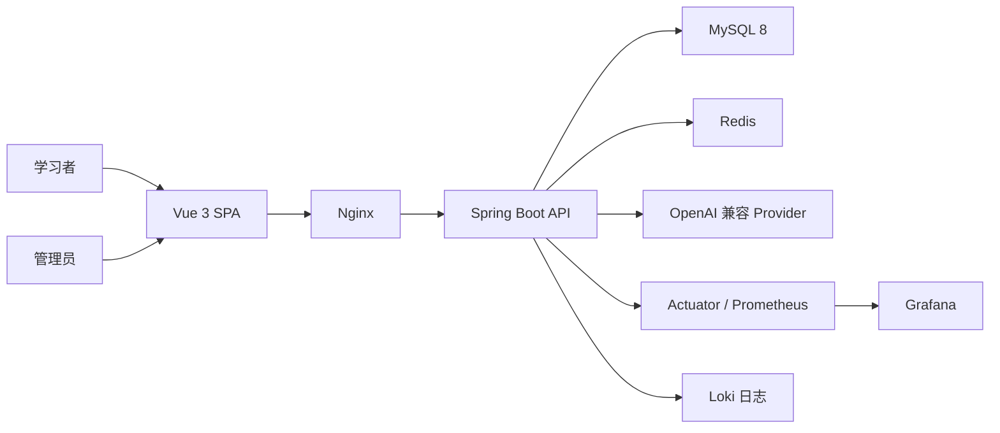

# 系统架构

LearnPlatform 是前后端分离的单体 Web 应用。Vue SPA 负责用户端和管理端交互，Spring Boot 提供统一 REST/SSE API，MySQL 保存业务事实，Redis 提供缓存，AI Provider 通过兼容 OpenAI 的接口接入。

## 系统上下文

用户端和管理端在同一个前端工程中，通过路由和后端角色权限区分。后端是模块化单体，不引入微服务、消息队列或分布式事务。

## 架构文档

| 文档 | 内容 |
|---|---|
| [前端架构](frontend.md) | 页面、组件、状态、请求和安全渲染 |
| [后端架构](backend.md) | 分层、事务、认证、错误处理和模块边界 |
| [AI 子系统](ai-system.md) | Provider、流式响应、资产、治理和观察 |
| [核心数据流](data-flow.md) | 练习、考试、投稿、复习和 AI 学习 |
| [部署架构](deployment.md) | Docker Compose、Nginx、监控和环境配置 |
| [架构决策](decisions/index.md) | 已确认的重要方案及其权衡 |

API 和表结构分别见[API 参考](../reference/api/index.md)与[数据库参考](../reference/database/index.md)。

## 设计原则

1. 以可运行、可测试和可演示为优先，不引入当前规模不需要的基础设施。
2. Controller 处理协议与权限边界，Service 承担业务规则和事务，Mapper 只负责数据访问。
3. 前端不保存判分、权限和配额等最终事实。
4. AI 是可降级的辅助能力，核心刷题、考试和复习闭环不依赖 AI 才能运行。
5. 接口、数据库和架构变化必须同步专项文档与回归测试。

## 权威来源

| 事项 | 事实来源 |
|---|---|
| 接口路径和方法 | Spring Controller 与 OpenAPI |
| 请求和响应字段 | DTO、VO、前端 API 类型 |
| 数据库结构 | Flyway V1–V19 |
| 权限 | `SecurityConfig` 与业务 Service |
| 部署服务和端口 | Compose、Dockerfile、Nginx 配置 |
| 当前阶段和验证数字 | `docs/project/status.md` |
