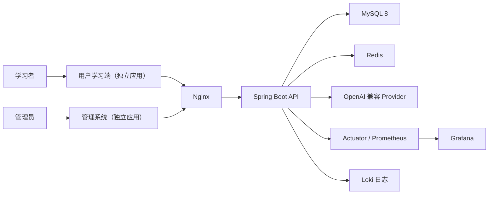

# 系统架构

LearnPlatform 当前是前后端分离的模块化单体 Web 应用。用户学习端和管理系统拥有
独立 HTML 入口、Router、布局和构建产物，并继续复用同一前端依赖工程、Spring Boot
后端、账号体系和业务数据。Spring Boot 提供统一 REST/SSE API，MySQL 保存业务事实，
Redis 提供缓存，AI Provider 通过兼容 OpenAI 的接口接入。

## 系统上下文

两端仍位于同一个前端依赖工程中，但不共享 Router 或布局。前端分离不构成权限边界；
管理权限始终由后端校验。后端继续保持模块化单体，不引入第二套后端、数据库、微服务、
消息队列或分布式事务。

课程学习平台以统一课程学习状态连接 AI 教学与试卷学习。课程位置、题目作答、错题、
复习、课件互动和测评必须通过明确事件更新同一业务事实，不能由两个入口维护互相
冲突的进度副本。目标边界见 [ADR-0005](decisions/0005-course-learning-state.md) 与
[ADR-0006](decisions/0006-separate-learner-admin-frontends.md)。

## 架构文档

| 文档 | 内容 |
|---|---|
| [前端架构](frontend.md) | 页面、组件、状态、请求和安全渲染 |
| [后端架构](backend.md) | 分层、事务、认证、错误处理和模块边界 |
| [AI 子系统](ai-system.md) | Provider、流式响应、资产、治理和观察 |
| [核心数据流](data-flow.md) | 练习、考试、投稿、复习和 AI 学习 |
| [AiStu 资源复用](aistu-resource-reuse.md) | 408 知识、Tutor 协议和互动课件的迁移边界 |
| [部署架构](deployment.md) | Docker Compose、Nginx、监控和环境配置 |
| [架构决策](decisions/index.md) | 已确认的重要方案及其权衡 |

API 和表结构分别见[API 参考](../reference/api/index.md)与[数据库参考](../reference/database/index.md)。

## 设计原则

1. 以可运行、可测试和可演示为优先，不引入当前规模不需要的基础设施。
2. Controller 处理协议与权限边界，Service 承担业务规则和事务，Mapper 只负责数据访问。
3. 前端不保存判分、权限和配额等最终事实。
4. AI 负责受课程范围约束的教学编排；上游不可用时，已有原题、考试、错题和复习能力仍能运行。
5. AI 教学和试卷学习共享课程学习状态，前端临时状态不冒充后端业务事实。
6. 用户学习端与管理系统入口、路由和构建独立，后端权限、账号和数据保持统一。
7. 接口、数据库和架构变化必须同步专项文档与回归测试。

## 权威来源

| 事项 | 事实来源 |
|---|---|
| 接口路径和方法 | Spring Controller 与 OpenAPI |
| 请求和响应字段 | DTO、VO、前端 API 类型 |
| 数据库结构 | `backend/src/main/resources/db/migration/` |
| 权限 | `SecurityConfig` 与业务 Service |
| 部署服务和端口 | Compose、Dockerfile、Nginx 配置 |
| 当前阶段和验证数字 | `docs/project/status.md` |
