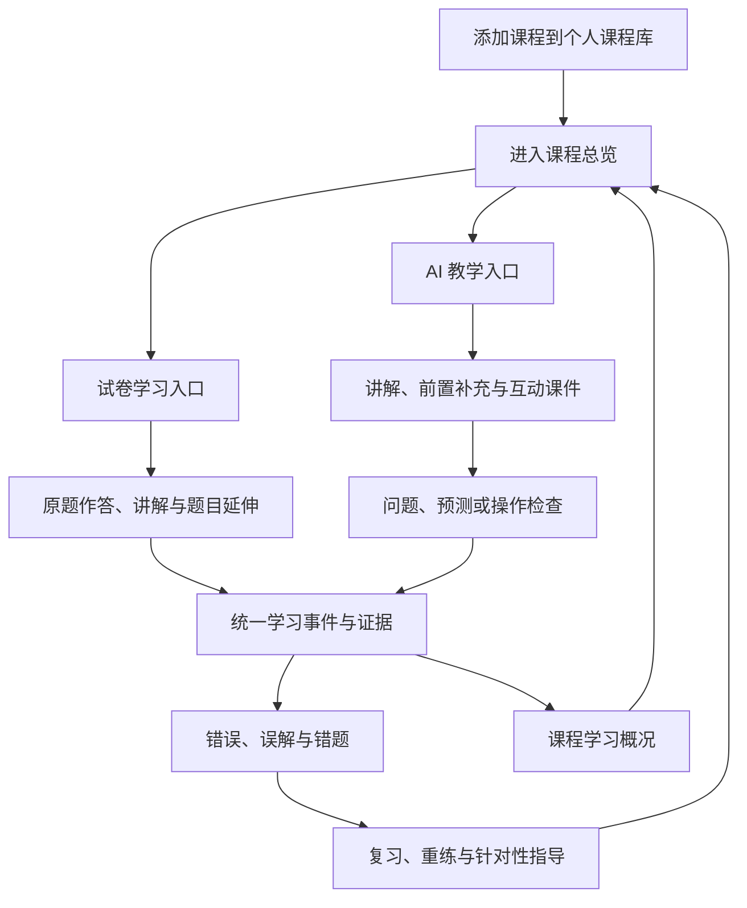

# 产品需求文档

## 产品定位

LearnPlatform 是一个 Web 优先的 AI 课程学习平台。产品以学习者在一门课程中的长期
学习过程为中心，通过 AI 教学与试卷学习两个入口，把可靠知识、互动课件、练习、
错题、复习和测评连接成可持续的学习闭环。

题库、判分和考试是重要业务底座，但不再单独决定产品的信息架构；AI 也不是附着在
题目旁边的解析按钮，而是受课程结构和学习状态约束的教学组织者。

项目同时承担个人学习工具和中大型 Web 项目展示用途，优先保证：

1. 真实可运行；
2. 核心学习闭环完整；
3. 教学状态、权限、判分和数据一致性可解释；
4. 可持续扩展和测试；
5. 文档、实现和演示一致。

## 目标用户

| 用户 | 主要目标 |
|---|---|
| 课程学习者 | 将课程加入个人课程库，在 AI 引导下持续学习、练习和复盘 |
| 备考用户 | 学习权威考试原题、完成测评并围绕错题得到针对性辅导 |
| 资料学习者 | 上传自己的试卷或题库，将原始资料转化为可讲解、可练习的私有学习材料 |
| 内容管理员 | 管理课程、知识点、官方试卷、题目、课件、审查和内容版本 |
| 平台管理员 | 管理用户、角色、AI 配额、成本、调用审计和平台运行状态 |

当前不定位为学校教务、多租户 SaaS、班级作业系统或自动外部内容采集平台。

## 产品组织

### 课程商店与个人课程库

平台按考试、科目和课程组织内容。用户可以像管理数字内容库一样将课程添加到个人
课程库，再进入课程专属学习空间。添加课程只建立学习入口，不代表开始学习或完成
课程。

每门课程独立维护：

- 课程目录和知识点关系；
- 可选的学习起点与知识点自评；
- 当前教学位置和未完成内容；
- AI 教学会话；
- 试卷、练习、错题和复习任务；
- 课件互动和测评记录；
- 可解释的课程学习概况。

### 课程总览

课程总览是学习中枢，至少为学习者提供：

- 继续学习；
- 当前学习位置；
- 待复习内容；
- 待处理错题；
- 最近学习记录；
- 主动测评入口；
- 课程目录和知识点状态。

总览展示内容进程、练习情况、复习状态和学习证据，不把浏览、时长或用户自评直接
换算为掌握度。

## 核心学习闭环

两个入口必须更新同一套课程学习状态。题库答错可以进入 AI 对话接受针对性讲解；
AI 教学发现的误解也可以生成练习和复习任务。

## 功能需求

### 认证与用户

- 用户可以通过已验证邮箱注册，使用用户名或邮箱登录、退出、找回密码和维护个人资料。
- 登录、注册邮件发送和忘记密码使用 Cloudflare Turnstile；身份会话使用 JWT，密码使用 BCrypt 哈希。
- 普通用户与管理员权限必须由后端校验。
- 管理员可以管理用户角色、状态、密码和用户级 AI 配额。

### 课程、目录与学习起点

- 管理员可以维护考试目录、课程、章节和树形知识点。
- 用户可以将课程添加到个人课程库并从课程总览继续学习。
- 用户可以填写粗粒度课程基础，也可以按需编辑单个知识点的理解程度；这些信息只影响教学起点，不直接作为掌握证据。
- 用户未指定知识点并发送“开始学习”时，系统根据未完成教学、到期复习、重要错误和默认课程顺序生成候选教学目标，AI 负责具体教学。

### AI 教学

- AI 可以根据课程范围、当前目标和学习记录进行讲解、补充必要前置、提出检查问题并安排后续内容。
- AI 可以在适合状态变化、执行过程、结构关系和动态交互的场景建议已注册互动课件。
- 课件不是每个知识点或每道题的强制展示方式；普通文字、公式、表格或分步提示能够完成教学时不机械打开课件。
- AI 教学产生的题目、误解、作答和课件互动必须通过结构化学习事件进入统一课程状态。
- AI 未配置或上游失败时，已有原题练习、考试、错题和复习能力仍可运行。

### 官方试卷与题库

- 平台公共题库主要保存各类权威考试的原题试卷，并保留考试、年份、分区、大题、小题、子问题、题号、分值和来源。
- 原题内容与 AI 教学增强分层保存；AI 不能修改原题后继续将其标记为原题。
- 同一张试卷支持学习模式、考试模式和复盘模式。
- 学习模式允许逐题作答、AI 辅导、必要的前置补充、互动课件和针对性练习。
- 考试模式保持完整试卷结构、时限和提交后判分，不提前暴露答案与提示。
- 复盘模式围绕错题、用时、提示使用和后续迁移练习组织。

### 用户上传资料

- 用户可以上传自己的试卷、题库或练习资料，并在解析后确认结构再进入学习。
- 上传资料默认属于用户私有内容，不自动进入官方题库或公共内容。
- 原始文件保持可追溯，拆解后的试卷结构、题目语义、AI 教学增强和用户学习状态分层保存。
- 没有可靠答案的资料可以由 AI 生成答案与讲解，并在审查通过后进入正式学习流程。
- 支持格式、解析能力和容量限制由当前实现阶段确定，不承诺首期覆盖扫描件和所有复杂版式。

### AI 生成与审查

- AI 可以参考一道或多道母题、课程知识、考试要求、当前教学目标和用户状态生成新题，母题不是强制的一对一变式模板。
- 生成题必须经过结构校验和审查 Agent；审查通过后在业务流程中视为正确的正式学习内容。
- 审查通过的生成题可以用于教学检查、普通练习、错题复盘和针对性测评。
- AI 生成题与官方原题保持来源区分，不以原题名义展示。
- 生成、审查和版本信息需要保留，以支持运营观察和内容维护。

### 练习、错题与复习

- 支持课程教学中的检查题、原题练习、AI 生成练习和主动题库练习。
- 客观题最终判分由后端执行并写入真实作答记录。
- 错题、对话误解和课件检查结果进入统一课程学习状态。
- 支持错题重练、针对性辅导和间隔复习。
- 同一道题的后续作答保留历史，不覆盖先前学习事实。

### 测评与学习概况

- 用户可以主动要求阶段测评，AI根据课程范围、学习记录和当前目标组织针对性测评。
- 完整模拟考试继续使用明确的试卷、时限、题目集合和服务端判分规则。
- 课程总览区分已学习内容、练习情况、待复习、错题和当前学习位置。
- 用户画像只在学习数据足够时形成，并使用与学习任务有关的可解释信号；数据不足时展示客观记录，不输出伪精确结论。

### 内容生产与治理

- 管理员可以维护课程、知识点、官方试卷、题目、课件和内容版本。
- 题目支持来源、纠错、复审、疑似重复和版本记录。
- 用户上传内容、平台官方内容和 AI 生成内容属于不同内容域，不自动互相升级。
- AI 生成题经审查 Agent 通过后可以进入学习流程；将用户私有资料公开或升级为平台官方内容仍需独立的内容发布权限。

### 用户端与管理系统

- 用户学习端与管理员端采用独立前端应用目标，分别服务连续学习和内容运营工作流。
- 两端共用 Spring Boot 后端、账号体系和业务数据，管理员权限始终由后端校验。
- 管理员可以使用普通学习端，但普通用户不能调用管理接口。
- 当前不为前端分离引入第二套后端、第二套数据库、微服务或多仓库同步。

### AI 运营治理

- 记录调用功能、模型、成功状态、延迟、真实 Token、成本和 trace。
- 支持全局和用户级配额、调整审计、周期报告与异常提醒。
- 学习效果观察同时考虑样本量和去重学习者覆盖。
- 没有实验设计时只表达观察性关联，不使用因果表述。

## 非功能需求

### 安全

- 密码只保存 BCrypt 哈希。
- API Key、JWT Secret、数据库密码和 Token 不进入仓库与日志。
- 用户资源校验归属，管理接口校验角色；前端路由隔离不作为权限边界。
- Markdown 和 AI HTML 内容必须净化。
- 判分、考试总分、配额、审查和发布状态不能信任客户端。
- 用户私有上传资料不因管理员前端独立而默认向所有管理员开放正文。

### 一致性

- 课程学习事件必须有稳定标识、来源和时间，两个学习入口不能维护互相冲突的进度副本。
- 练习判分、考试提交、投稿入库和配额调整使用事务。
- 并发不变量使用数据库唯一约束兜底。
- 数据库演进只通过 Flyway 新迁移完成。

### 性能与可维护性

- 列表分页，常用筛选字段建立必要索引。
- Redis 只缓存适合重建的数据，不作为业务事实来源。
- 前端按应用、页面和能力拆包，AI 流式内容增量渲染。
- 前后端按业务域组织 API 和 Service。
- 不为产品转型立即重写成熟技术栈，也不引入当前规模不需要的微服务、消息队列、微前端或复杂推荐基础设施。

### 可观测性

- 提供健康检查、Prometheus 指标、Grafana 看板和 Loki 日志。
- AI 调用通过 traceId、Prompt 指纹和模型配置指纹追踪。
- 生成题与审查任务保留必要版本和状态，不记录原始秘密和不必要的用户隐私内容。

## 页面范围

### 用户学习端

- 登录、注册与个人资料
- 课程商店与个人课程库
- 课程总览与课程目录
- AI 对话学习
- 官方试卷与用户资料
- 试卷学习、考试和复盘
- 练习、错题与复习
- 学习概况与主动测评
- 全局搜索与投稿状态

### 管理系统

- 平台总览
- 考试目录、课程和知识点管理
- 官方试卷、题目、纠错、复审和版本管理
- AI 生成、审查和教学增强任务
- 互动课件管理
- 用户上传与投稿治理
- 用户、角色、AI 配额、成本、提醒和运行状态

页面文件和路由以真实前端源码为准，不在 PRD 中维护逐文件目录。

## 范围边界

以下方向不属于默认产品范围：

- 爬虫和未经许可的外部内容自动采集；
- 用户上传内容自动公开或自动升级为官方内容；
- 多租户教务、班级和教师作业；
- 复杂向量推荐、多模型自动路由；
- 原生移动端；
- 为每道题机械生成互动课件；
- 在 Web 核心闭环稳定前同步重做桌面端。

候选方向和进入条件见[后续扩展方向](future.md)，当前阶段见[项目状态](../project/status.md)。

## 验收

产品验收关注真实学习结果和跨入口一致性：用户能够将课程加入个人课程库，从 AI 教学
或试卷学习进入同一课程状态，完成讲解、检查、错题和复习闭环；权限、判分、内容来源
和失败语义符合需求，客户端不能伪造判分、权限、配额或发布状态。

工程交付流程见[开发工作流](../development/workflow.md)。接口契约见[API 参考](../reference/api/index.md)，数据模型见[数据库参考](../reference/database/index.md)。
