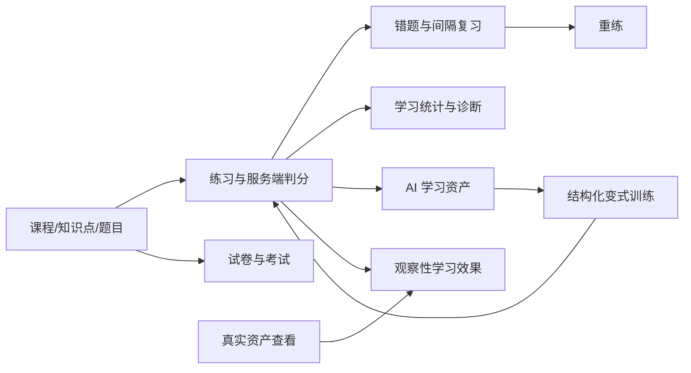

# 产品需求文档

## 产品定位

LearnPlatform 是面向个人学习、刷题和备考场景的 AI 题库与错题复习平台。它以真实判分、错题复习和考试为业务底座，把 AI 生成内容沉淀为可查看、可反馈、可训练和可观察的学习资产。

项目同时承担个人学习工具和中大型 Web 项目展示用途，优先保证：

1. 真实可运行；
2. 核心业务闭环完整；
3. 权限、判分和数据一致性可解释；
4. 可持续扩展和测试；
5. 可部署、可演示。

## 目标用户

| 用户 | 主要目标 |
|---|---|
| 学习者 | 按课程和知识点练习、复习错题、参加考试、获得学习辅助 |
| 备考用户 | 通过错题、间隔重复、统计和模拟考试形成复习闭环 |
| 内容管理员 | 管理课程、题目、试卷、投稿、纠错和内容版本 |
| 平台管理员 | 管理用户、AI 配额、调用成本、提醒和观察性效果 |

当前不定位为学校教务、多租户 SaaS 或自动内容采集平台。

## 核心业务闭环

## 功能需求

### 认证与用户

- 用户可以注册、登录、退出和维护个人资料。
- 登录使用验证码、JWT 和 BCrypt 密码哈希。
- 普通用户与管理员权限必须由后端校验。
- 管理员可以管理用户角色、状态、密码和用户级 AI 配额。

### 课程、知识点与题库

- 管理员可以维护课程和树形知识点。
- 题目支持单选、多选、判断、填空和简答。
- 题目包含课程、知识点、难度、分值、来源、答案和解析等信息。
- 用户可以筛选和查看题目，但提交前不能获取正确标记或私有答案。
- 支持收藏、评论和纠错反馈。

### 练习、错题与复习

- 支持按课程、知识点、题型、难度、顺序或随机方式练习。
- 所有最终判分由后端执行并写入真实练习记录。
- 答错题目自动进入错题本，支持掌握状态和重练。
- 支持基于 SM-2 的间隔重复计划、到期卡片和复习质量提交。
- 自适应练习和相似题推荐优先使用可解释规则和已有题库。

### 试卷与考试

- 管理员可以手动或智能组卷、配置分值、时限并发布试卷。
- 用户可以开始、恢复、提交考试并查看本人结果。
- 后端校验记录归属、题目集合、重复题号和考试时限。
- 已发布试卷及已有考试事实受不可变规则保护。

### AI 学习

- 提供同步和流式题目解析、复习建议、知识总结与变式生成。
- 解析、误区、步骤等内容可以作为题目学习资产缓存。
- 用户可以反馈资产质量；真实展开后记录查看事件。
- 结构化变式题必须把公开题面和私有答案分离，并由后端完成首次判分。
- AI 未配置或上游失败时，核心练习、考试和复习功能仍可用。

### 学习诊断与推荐

- 提供练习趋势、课程统计、薄弱知识点、学习报告和知识图谱数据。
- 支持单题错因分析、相似题推荐和 AI 个性化建议。
- 建议结果必须说明其辅助性质，不能伪装成确定性学习结论。

### 内容生产与治理

- 用户可以投稿并查询本人投稿状态。
- 管理员可以审核、拒绝、AI 辅助质检、标注知识点、评估难度并显式入库。
- 正式题目支持来源、复审、纠错、疑似重复和版本记录。
- AI 不得绕过管理员自动发布题目或修改标准答案。

### AI 运营治理

- 记录调用功能、模型、成功状态、延迟、真实 Token、成本和 trace。
- 支持全局和用户级配额、调整审计、周期报告与异常提醒。
- 学习效果观察同时考虑样本量和去重学习者覆盖。
- 没有实验设计时只表达观察性关联，不使用因果表述。

## 非功能需求

### 安全

- 密码只保存 BCrypt 哈希。
- API Key、JWT Secret、数据库密码和 Token 不进入仓库与日志。
- 用户资源校验归属，管理接口校验角色。
- Markdown 和 AI HTML 内容必须净化。
- 判分、考试总分、配额和审核状态不能信任客户端。

### 一致性

- 练习判分、考试提交、投稿入库和配额调整使用事务。
- 并发不变量使用数据库唯一约束兜底。
- 数据库演进只通过 Flyway 新迁移完成。

### 性能

- 列表分页，常用筛选字段建立必要索引。
- Redis 只缓存适合重建的数据，不作为业务事实来源。
- 前端按页面和能力拆包，AI 流式内容增量渲染。
- AI 资产优先复用缓存，避免无意义重复调用。

### 可维护性

- 前后端按业务域组织 API 和 Service。
- 行为变化必须有相称的测试和文档同步。
- 架构、API、数据库、状态和历史分别使用独立权威文档。
- 不引入当前规模不需要的微服务、消息队列和复杂推荐基础设施。

### 可观测性

- 提供健康检查、Prometheus 指标、Grafana 看板和 Loki 日志。
- AI 调用通过 traceId、Prompt 指纹和模型配置指纹追踪。
- 日志不保存原始秘密和不必要的用户隐私内容。

## 页面范围

### 用户端

- 登录与注册
- 学习首页
- 课程与知识点
- 题库与题目学习
- 练习、记录与错题
- 复习计划
- 试卷、考试与结果
- 学习统计与诊断
- 投稿与个人状态
- 全局搜索与个人资料

### 管理端

- 平台总览
- 用户、课程和知识点管理
- 题目、纠错、复审和版本管理
- 试卷管理
- 投稿审核与入库
- AI 调用、配额、成本、提醒和效果观察

页面文件和路由以真实前端源码为准，不在 PRD 中维护逐文件目录。

## 当前范围与排除项

当前主线是 Phase 22 的真实学习样本积累和效果观察。以下方向不进入近期范围：

- OCR、爬虫和外部内容自动采集；
- 用户上传题库自动入库；
- AI 自动审核发布；
- 多租户教务、班级和教师作业；
- 复杂向量推荐、多模型自动路由；
- 原生移动端。

候选方向和进入条件见[后续扩展方向](future.md)，阶段状态见[项目状态](../project/status.md)。

## 验收

功能完成必须同时满足：

- 前后端接入真实接口；
- 权限和失败分支得到验证；
- 必要的单元、契约、集成或 E2E 测试通过；
- API、数据库或架构变化同步专项文档；
- README、演示和简历不夸大能力。

接口契约见[API 参考](../reference/api/index.md)，数据模型见[数据库参考](../reference/database/index.md)。
