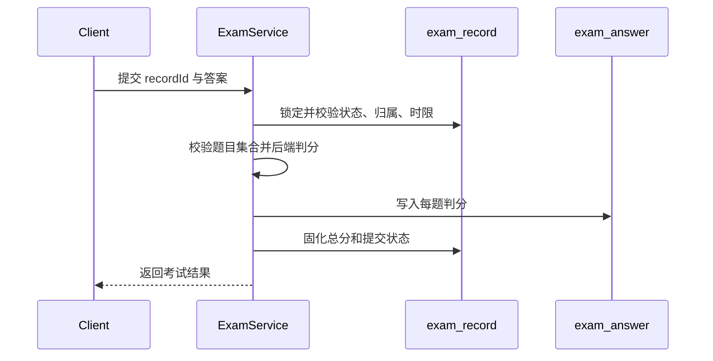

# 练习、复习与考试数据

## 练习与错题

| 表 | 首次迁移 | 职责 | 关键约束 |
|---|---|---|---|
| `practice_record` | V1 | 每次题目作答、答案、正确性和时间 | 作为学习统计与观察的事实记录 |
| `wrong_question` | V1 | 用户当前错题状态、次数和掌握程度 | 同一用户与题目维持一个当前状态 |
| `learning_plan` | V1，V3 补齐 | 用户学习目标和计划 | V3 使用幂等创建兼容旧数据库 |
| `question_review_schedule` | V9 | SM-2 复习调度状态 | 同一用户与题目唯一；保存间隔和到期时间 |

练习提交先写入 `practice_record`，再按判分结果同步 `wrong_question` 和必要的复习计划。统计必须从真实记录计算，不能由前端累计值作为事实。

## 试卷与考试

| 表 | 首次迁移 | 职责 | 关键约束 |
|---|---|---|---|
| `exam_paper` | V1，V75、V83 扩展 | 试卷元数据、总分、时限、来源、所有者、可见性和发布状态 | 发布后修改受限；官方试卷发布前必须核验来源；私有试卷只允许所有者访问 |
| `exam_question` | V1，V75 扩展 | 试卷题目、顺序、分值和原始题号结构 | 试卷与题目组合唯一；官方试卷必须有展示题号 |
| `exam_record` | V1，V77 扩展 | 用户一次限时考试的状态、时间、总分和活动幂等键 | 同一用户和试卷最多一个活动记录；完成或超时后释放活动键 |
| `exam_answer` | V1，V2 加固，V81 扩展 | 每题答案、自动或人工判分状态、得分和批阅结果 | V2 增加记录与题目唯一约束；V81 保存批阅人、评语、明细和时间 |
| `subjective_grading_point` | V81 | 主观题的可复核评分点、参考答案和分值 | 同一题评分点键唯一；发布时评分点总分必须等于题目分值 |
| `exam_learning_session` | V76 | 用户在一张课程试卷上的一轮逐题学习 | 进行中幂等键唯一；完成后释放以允许新一轮 |
| `exam_learning_answer` | V76 | 学习会话中每题的每次尝试、判分和耗时 | 会话、题目和尝试序号组合唯一 |
| `exam_learning_ai_interaction` | V79 | 基于试卷学习最近一次作答的 AI 辅导交互 | 绑定用户、课程、试卷、会话、题目与答案；只保存状态和引用 |
| `user_exam_source` | V83 | 用户导入草稿或已确认试卷的原始资料名称、格式、哈希和全文 | 绑定所有者；原始正文只由所有者接口读取 |
| `private_exam_import_draft` | V84 | 缺失答案资料从草稿到确认启用的所有者状态机 | 只列出本人未确认草稿；确认事务按所有者锁行并关联唯一创建结果 |
| `private_exam_draft_question` | V84 | 逐题保存原答案、AI 建议和用户最终复核结果 | AI 建议与最终答案分层；未全部 `REVIEWED` 不得启用 |

## 限时考试活动记录

V77 为 `exam_record` 增加可空的 `active_exam_key`。活动记录使用 `EXAM:{userId}:{paperId}`，并由唯一
索引 `uk_exam_record_active` 保护并发开始不会形成两条活动记录。未过期活动记录会被复用；完成，或在
恢复、再次开始、提交时确认超时后，状态分别固化为 `1` 或 `2` 并将活动键置空，允许开始新一轮。

升级迁移先将已经超过试卷时限的历史活动记录标记为超时。同一用户和试卷仍有多条活动记录时，只保留按
`start_time`、`id` 排序最新的一条，其余记录标记为超时；历史记录不会被删除。记录列表可以按截止时间
派生显示超时状态，但只有恢复、再次开始或提交会持久化状态并释放活动键。

## 考试提交事务

重复题号、非试卷题目、越权记录或已提交记录必须被拒绝。V2 的唯一约束是服务校验之外的数据库兜底。
考试结果中的来源和原始题号由 V75 的不可变 `exam_paper`、`exam_question` 配置映射返回，不会复制为
`exam_record` 或 `exam_answer` 的快照字段。

V81 将 `SHORT_ANSWER` 从关键词命中自动判分中移出。提交事务仍立即固化客观题答案与暂定总分，但主观题
答案以 `PENDING` 保存、得分和正确性为空，考试记录进入状态 `3`。管理员必须按题目配置逐项给分；服务端
锁定答案和记录、校验评分点集合与分值范围，将明细保存为 JSON，并重新汇总该记录的全部答案。仍有任一
`PENDING` 答案时记录保持状态 `3`，全部完成后才进入状态 `1`。待批阅结果不暴露参考答案和解析。

## 试卷学习事务

试卷学习与限时考试使用不同状态机。开始学习时，服务端要求试卷已发布、已关联课程，且当前用户已经
加入该课程；同一用户与试卷的 `active_session_key` 保证并发开始只形成一个进行中会话。逐题提交时锁定
会话，校验创建者、会话状态、题目归属和课程归属，再由服务端判分并递增该题尝试序号。每次判分继续
写入错题、复习计划与统一课程学习事件，但不会创建 `exam_answer` 或考试成绩。

完成操作要求试卷中的每道题至少存在一次尝试。完成后会话状态固化、完成时间写入，并将进行中幂等键
置空；历史会话与全部尝试继续保留用于逐题复盘。未作答题目的答案和解析不能因读取学习会话而提前暴露。

V79 将解析和变式辅导绑定到当前用户拥有的学习会话、题目及其最近一次答案。未作答题目不能调用该入口；
交互状态为 `0` 处理中、`1` 成功、`2` 失败，成功后以交互 ID 形成幂等课程学习事件。表中不保存完整
提示词或模型输出，既保留跨入口连续学习所需的业务证据，也避免复制大段 AI 内容成为第二份事实来源。

## 官方试卷来源与题号

V75 只增加来源和原始题号结构，不导入任何试卷或题目。`exam_paper.paper_type` 当前区分
`PRACTICE` 和 `OFFICIAL_EXAM`；官方试卷还保存考试名称、年份、可复核
来源和人工核验状态。`exam_question` 保存分区、大题号、小题号、子题号与面向学习者的完整
展示题号。

服务端发布门禁要求 `OFFICIAL_EXAM` 同时满足：

- 考试名称、1900 至当前年份之间的考试年份和来源引用完整；
- `source_verified = 1`；
- 试卷非空，且每道关联题都有 `display_number`。

普通练习不因缺少上述字段而被误判为官方试卷。来源不完整时应保留草稿，不能用自拟题、AI 生成题
或无出处题目替代官方原题。

## 用户私有试卷

V83 为 `exam_paper` 和 `question` 增加 `owner_user_id` 与 `visibility`；存量内容通过非空默认值保持
`PUBLIC`。确认导入的试卷使用 `paper_type=USER_PRIVATE`、`visibility=PRIVATE`、`status=1` 和
`import_status=CONFIRMED`，其拆解题目也绑定相同所有者与私有可见性。`source_record_id` 指向
`user_exam_source`，后者保存原始名称、`MARKDOWN/TEXT` 格式、SHA-256 和用户确认时的原文。

预览不写库；确认时原始资料、试卷、题目、选项和关联关系在同一事务中创建。用户端读取、考试开始和
学习会话均校验试卷可见性，公共题库、练习候选、搜索、相似题、AI 资产、管理列表和管理统计排除其他
用户私有内容。原始正文不进入管理端官方内容治理链，也不会自动公开。

V84 将无答案资料与正式可判分内容分离。`private_exam_import_draft` 使用
`DRAFT → AI_GENERATED/REVIEWING → READY → CONFIRMED` 状态，`confirmed_paper_id` 保存确认结果；
`private_exam_draft_question` 分开保存原资料答案、AI 建议答案/解析和用户最终答案/解析。缺失原答案的题
必须先得到通过结构校验的 AI 建议，之后仍由所有者逐题提交最终复核；服务端只根据 `final_*` 字段创建
正式私有题目。确认事务通过 `SELECT ... FOR UPDATE` 防止并发重复创建，重复请求读取已关联试卷。

私有内容删除不新增逻辑删除状态：未确认草稿按所有者锁行后物理删除；已启用试卷先确认其考试、学习和
题目衍生引用均为零，再在同一事务中清理试卷题目关系、专属题目、选项、知识点关系及关联确认草稿。
`user_exam_source` 只有在不存在任何草稿或有效试卷引用时才随之删除。已有学习事实的私有试卷拒绝删除，
以保留考试结果、错题、收藏和复习等记录的一致性。

V78 从已核对标题、正文和题号的 2026 年 408 真题页面迁入当前课程范围内的数据结构选择题第 1–11 题，
共 11 题、44 个选项和 22 分。试卷保留全国统考名称、年份、来源 URL、数据结构分区与完整原始题号，
每题映射到课程顶层知识点。当前课程不包含组成原理、操作系统和计算机网络，因此未将其他分区错误归入
数据结构课程。

V82 迁入同一来源的数据结构综合应用题第 41、42 题及 7 个评分点，并另建 45 分、13 题的
`2026 年 408 真题·数据结构部分`。迁移复制既有第 1–11 题关系而不修改已发布的 22 分客观题卷，避免改变
历史考试引用；新试卷中客观题自动判分，两道综合题提交后按 V81 流程人工批阅。
