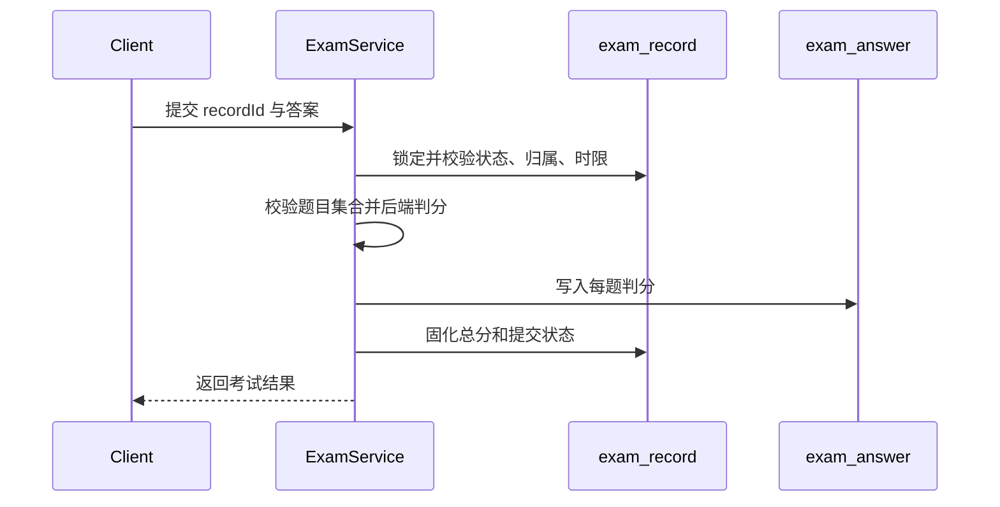

# 练习、复习与考试数据

## 练习与错题

| 表 | 首次迁移 | 职责 | 关键约束 |
|---|---|---|---|
| `practice_record` | V1 | 每次题目作答、答案、正确性和时间 | 作为学习统计与观察的事实记录 |
| `wrong_question` | V1 | 用户当前错题状态、次数和掌握程度 | 同一用户与题目维持一个当前状态 |
| `learning_plan` | V1，V3 补齐 | 用户学习目标和计划 | V3 使用幂等创建兼容旧数据库 |
| `question_review_schedule` | V9 | SM-2 复习调度状态 | 同一用户与题目唯一；保存间隔和到期时间 |

练习提交先写入 `practice_record`，再按判分结果同步 `wrong_question` 和必要的复习计划。统计必须从真实记录计算，不能由前端累计值作为事实。

## 试卷与考试

| 表 | 首次迁移 | 职责 | 关键约束 |
|---|---|---|---|
| `exam_paper` | V1，V75 扩展 | 试卷元数据、总分、时限、来源和发布状态 | 发布后修改受限；官方试卷发布前必须核验来源 |
| `exam_question` | V1，V75 扩展 | 试卷题目、顺序、分值和原始题号结构 | 试卷与题目组合唯一；官方试卷必须有展示题号 |
| `exam_record` | V1 | 用户一次考试的状态、时间和总分 | 开始、提交形成状态机 |
| `exam_answer` | V1，V2 加固 | 每题答案、得分和正确性 | V2 增加考试记录与题目唯一约束 |
| `exam_learning_session` | V76 | 用户在一张课程试卷上的一轮逐题学习 | 进行中幂等键唯一；完成后释放以允许新一轮 |
| `exam_learning_answer` | V76 | 学习会话中每题的每次尝试、判分和耗时 | 会话、题目和尝试序号组合唯一 |

## 考试提交事务

重复题号、非试卷题目、越权记录或已提交记录必须被拒绝。V2 的唯一约束是服务校验之外的数据库兜底。

## 试卷学习事务

试卷学习与限时考试使用不同状态机。开始学习时，服务端要求试卷已发布、已关联课程，且当前用户已经
加入该课程；同一用户与试卷的 `active_session_key` 保证并发开始只形成一个进行中会话。逐题提交时锁定
会话，校验创建者、会话状态、题目归属和课程归属，再由服务端判分并递增该题尝试序号。每次判分继续
写入错题、复习计划与统一课程学习事件，但不会创建 `exam_answer` 或考试成绩。

完成操作要求试卷中的每道题至少存在一次尝试。完成后会话状态固化、完成时间写入，并将进行中幂等键
置空；历史会话与全部尝试继续保留用于逐题复盘。未作答题目的答案和解析不能因读取学习会话而提前暴露。

## 官方试卷来源与题号

V75 只增加来源和原始题号结构，不导入任何试卷或题目。`exam_paper.paper_type` 当前区分
`PRACTICE` 和 `OFFICIAL_EXAM`；官方试卷还保存考试名称、年份、可复核
来源和人工核验状态。`exam_question` 保存分区、大题号、小题号、子题号与面向学习者的完整
展示题号。

服务端发布门禁要求 `OFFICIAL_EXAM` 同时满足：

- 考试名称、1900 至当前年份之间的考试年份和来源引用完整；
- `source_verified = 1`；
- 试卷非空，且每道关联题都有 `display_number`。

普通练习不因缺少上述字段而被误判为官方试卷。来源不完整时应保留草稿，不能用自拟题、AI 生成题
或无出处题目替代官方原题。用户私有试卷在所有者隔离与可见性规则完成前不开放写入。
