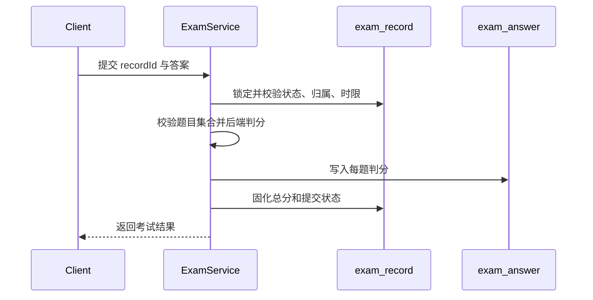

# 练习、复习与考试数据

## 练习与错题

| 表 | 首次迁移 | 职责 | 关键约束 |
|---|---|---|---|
| `practice_record` | V1 | 每次题目作答、答案、正确性和时间 | 作为学习统计与观察的事实记录 |
| `wrong_question` | V1 | 用户当前错题状态、次数和掌握程度 | 同一用户与题目维持一个当前状态 |
| `learning_plan` | V1，V3 补齐 | 用户学习目标和计划 | V3 使用幂等创建兼容旧数据库 |
| `question_review_schedule` | V9 | SM-2 复习调度状态 | 同一用户与题目唯一；保存间隔和到期时间 |

练习提交先写入 `practice_record`，再按判分结果同步 `wrong_question` 和必要的复习计划。统计必须从真实记录计算，不能由前端累计值作为事实。

## 试卷与考试

| 表 | 首次迁移 | 职责 | 关键约束 |
|---|---|---|---|
| `exam_paper` | V1 | 试卷元数据、总分、时限和发布状态 | 发布后修改受限 |
| `exam_question` | V1 | 试卷题目、顺序和分值快照 | 试卷与题目组合唯一 |
| `exam_record` | V1 | 用户一次考试的状态、时间和总分 | 开始、提交形成状态机 |
| `exam_answer` | V1，V2 加固 | 每题答案、得分和正确性 | V2 增加考试记录与题目唯一约束 |

## 考试提交事务

重复题号、非试卷题目、越权记录或已提交记录必须被拒绝。V2 的唯一约束是服务校验之外的数据库兜底。
