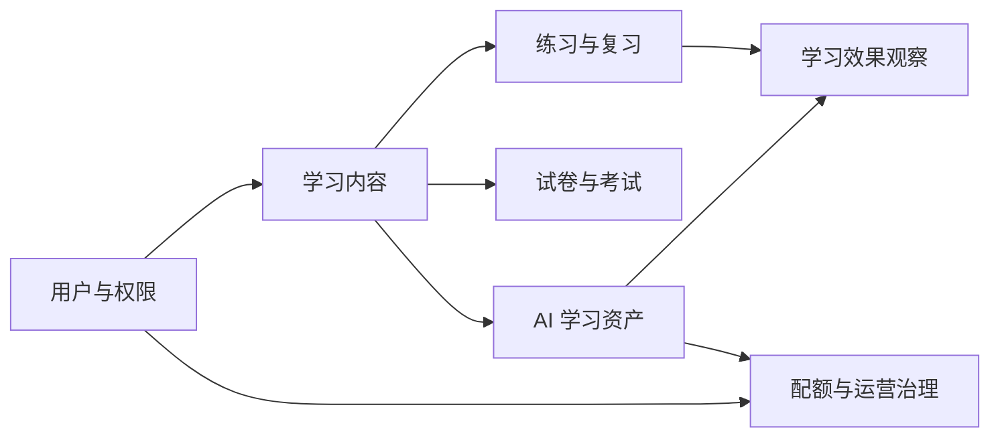

# 数据模型总览

## 领域边界

## 表清单

| 领域 | 表 |
|---|---|
| 用户与内容 | `user`、`course`、`knowledge_point`、`user_course`、`question`、`question_option`、`question_knowledge_point` |
| 互动与投稿 | `user_favorite_question`、`question_comment`、`comment_like`、`question_submission`、`question_correction_report`、`question_review_record`、`question_version` |
| 练习与复习 | `practice_record`、`wrong_question`、`learning_plan`、`question_review_schedule` |
| 试卷与考试 | `exam_paper`、`exam_question`、`exam_record`、`exam_answer` |
| AI 与运营 | `ai_call_log`、`ai_quota_audit_log`、`ai_usage_alert`、`question_ai_asset`、`ai_asset_feedback`、`ai_asset_view`、`ai_variant_training`、`ai_variant_question` |

## 关系原则

- `question` 是练习、错题、试卷、复习和 AI 资产共同引用的核心聚合。
- `user_course` 只表达用户拥有课程学习入口，不承担掌握度或学习完成状态。
- `question_knowledge_point` 和 `exam_question` 是多对多关系表。
- `practice_record` 和 `exam_answer` 保存真实判分事实，不能由前端统计结果反写。
- `wrong_question` 和 `question_review_schedule` 是从学习行为派生、但具有独立生命周期的用户状态。
- AI 学习效果由资产查看、变式训练和后续练习记录组合观察，不单独保存“AI 有效”结论。

## 通用字段

大多数业务表使用自增 `BIGINT` 主键，并按需要包含：

- `create_time`：创建时间。
- `update_time`：更新时间。
- `deleted`：逻辑删除标记。
- `status`：有限状态机当前值。

具体名称、默认值、长度和可空性以对应 Flyway SQL 为准。

## 一致性边界

- 同一用户、题目和业务周期内不能重复的事实使用唯一索引保护。
- 已发布试卷和已判分记录遵循不可变或受限修改规则。
- 逻辑外键删除前由 Service 检查引用关系。
- 涉及多个表的投稿入库、考试提交和练习判分必须在事务中完成。
